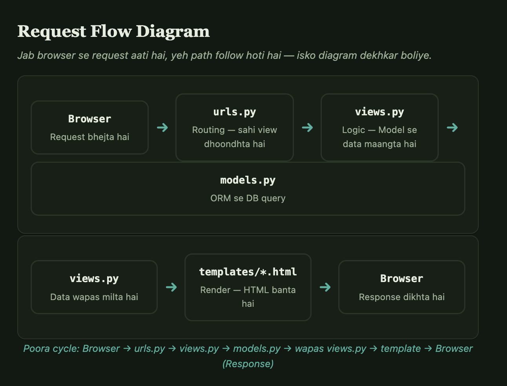

# 00 — Django Basics & Definition (Say This Out Loud)

> This file exists for one reason: interviewers ask "What is Django?" as an opener,
> and it's easy to blank on the simple answer while knowing the deep internals.
> Read this page first, before any other file in this folder. Practice saying it out loud.

---

## 🎤 The one-line answer (memorize this)

> **"Django is a high-level, open-source Python web framework that follows the MVT
> (Model-View-Template) architecture. It's 'batteries-included' — meaning ORM,
> authentication, admin panel, forms, and security features come built-in — which
> makes it fast to build secure, scalable web applications without stitching
> together separate libraries."**

If asked to go one sentence shorter:

> **"Django is a Python web framework for building web apps and APIs quickly,
> with a built-in ORM, admin interface, and strong security defaults."**

---

## 🧱 What "batteries-included" actually means

Unlike Flask/FastAPI (which are minimal and let you pick every piece), Django ships with:

| Built-in piece | What it does |
|---|---|
| **ORM** | Write Python classes, get SQL tables — no raw SQL needed for CRUD |
| **Admin panel** | Auto-generated CRUD UI for any model, zero extra code |
| **Auth system** | Users, groups, permissions, sessions, password hashing — ready to use |
| **Forms** | Validation + HTML rendering + CSRF protection out of the box |
| **Middleware** | Request/response hooks (auth, sessions, security headers) |
| **Security** | CSRF, XSS escaping, SQL-injection protection, clickjacking protection — on by default |
| **URL routing** | `urls.py` maps paths to views declaratively |
| **Migrations** | Schema changes tracked and applied via `manage.py migrate` |




---

## 🏛️ MVT Architecture (Django's spin on MVC)

```
Model    → defines data structure (maps to DB tables via ORM)
View     → business logic (Python function/class that processes the request)
Template → presentation (HTML with Django Template Language for dynamic content)
```

Key difference from classic MVC: in Django, the **framework itself acts as the
Controller** (routing the request to the right view via `urls.py`) — you only
write Model, View, and Template.

**Request flow:**
```
Browser request → urls.py (routing) → views.py (logic, talks to models) →
models.py (DB via ORM) → back to views.py → templates/*.html (render) → response
```

---

## 📦 Who made it / why it exists

- Created by **Django Software Foundation**, first released 2005 (Lawrence Journal-World newspaper team — hence built for fast newsroom deployment cycles).
- Written entirely in **Python**.
- Philosophy: **"The web framework for perfectionists with deadlines"** — rapid development + clean, pragmatic design.
- DRY (Don't Repeat Yourself) principle baked into the ORM and templating.

---

## 🆚 Quick comparison (if asked "why Django over X")

| vs | Key difference |
|---|---|
| **Flask/FastAPI** | Those are micro-frameworks (minimal, you assemble pieces yourself). Django is full-stack/batteries-included. |
| **Ruby on Rails** | Conceptually similar (both batteries-included, both MVC-family) — Django is Python's answer to Rails. |
| **Node/Express** | Express is minimal like Flask; Django gives you ORM+admin+auth for free. |

**When to pick Django:** content-heavy sites, admin-heavy internal tools, rapid CRUD apps, teams that want conventions decided for them.
**When to pick FastAPI/Flask instead:** microservices, high-performance async APIs, minimal footprint needed.

---

## 🔑 Django REST Framework (DRF) — one more line

> **"DRF is a toolkit built on top of Django specifically for building REST APIs —
> it adds serializers (Python objects ⇄ JSON), ViewSets, and browsable API docs."**

---

## 🎤 Practice drill

Say each of these out loud, in English, without reading:
1. What is Django? (one-liner)
2. What does "batteries-included" mean?
3. Explain MVT and the request flow.
4. Django vs Flask — one key difference.
5. What is DRF and why do you need it on top of Django?

Once these 5 come out smoothly, move to [01_orm_deep_dive.md](01_orm_deep_dive.md) for the technical depth.
