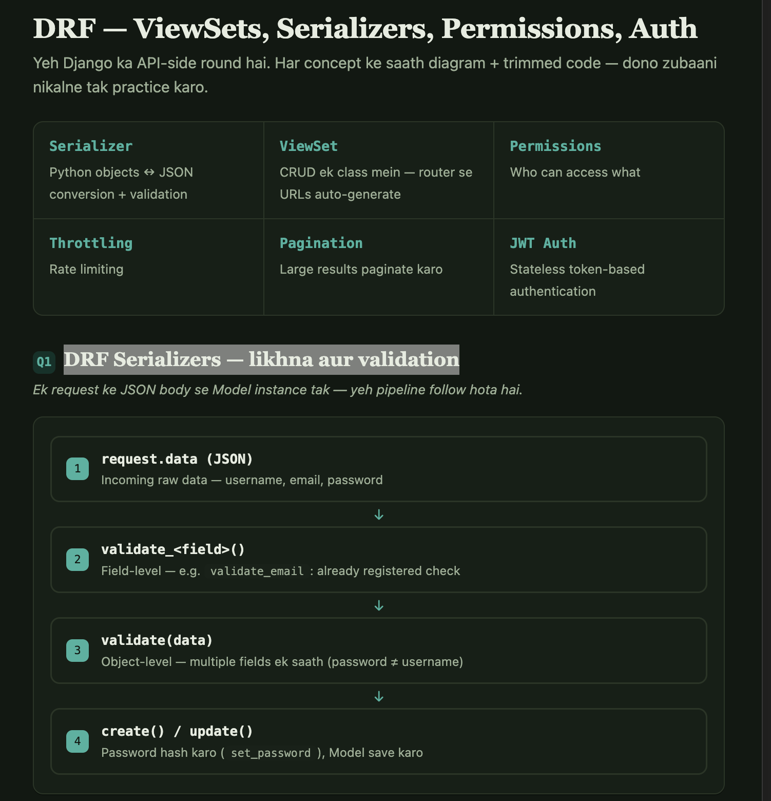
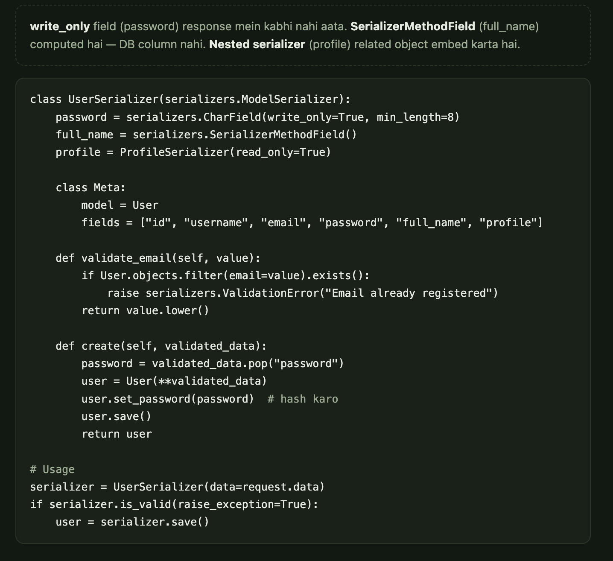
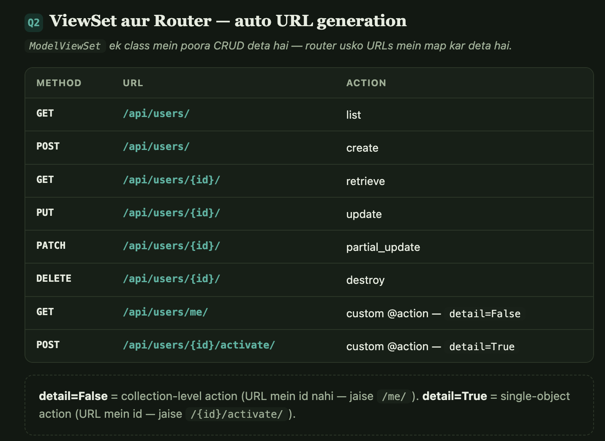
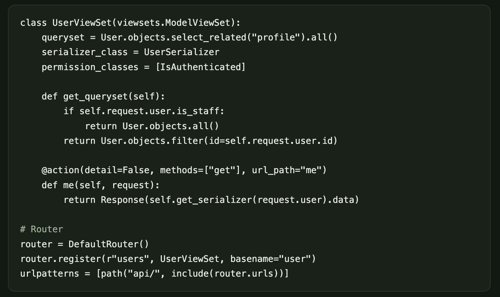
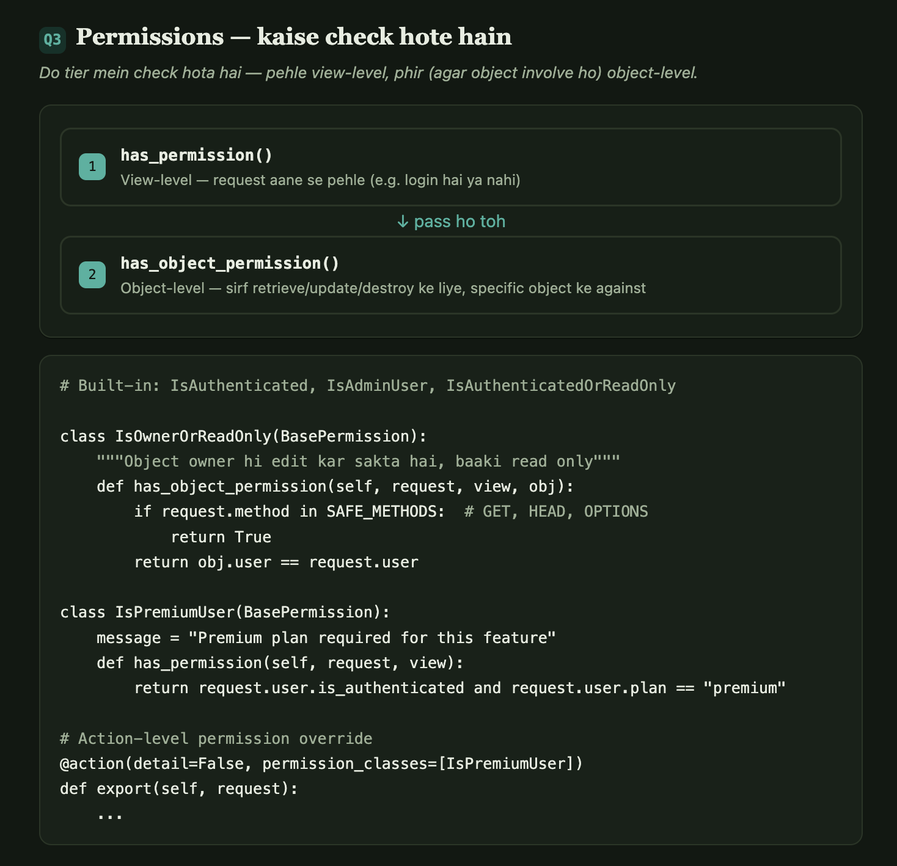
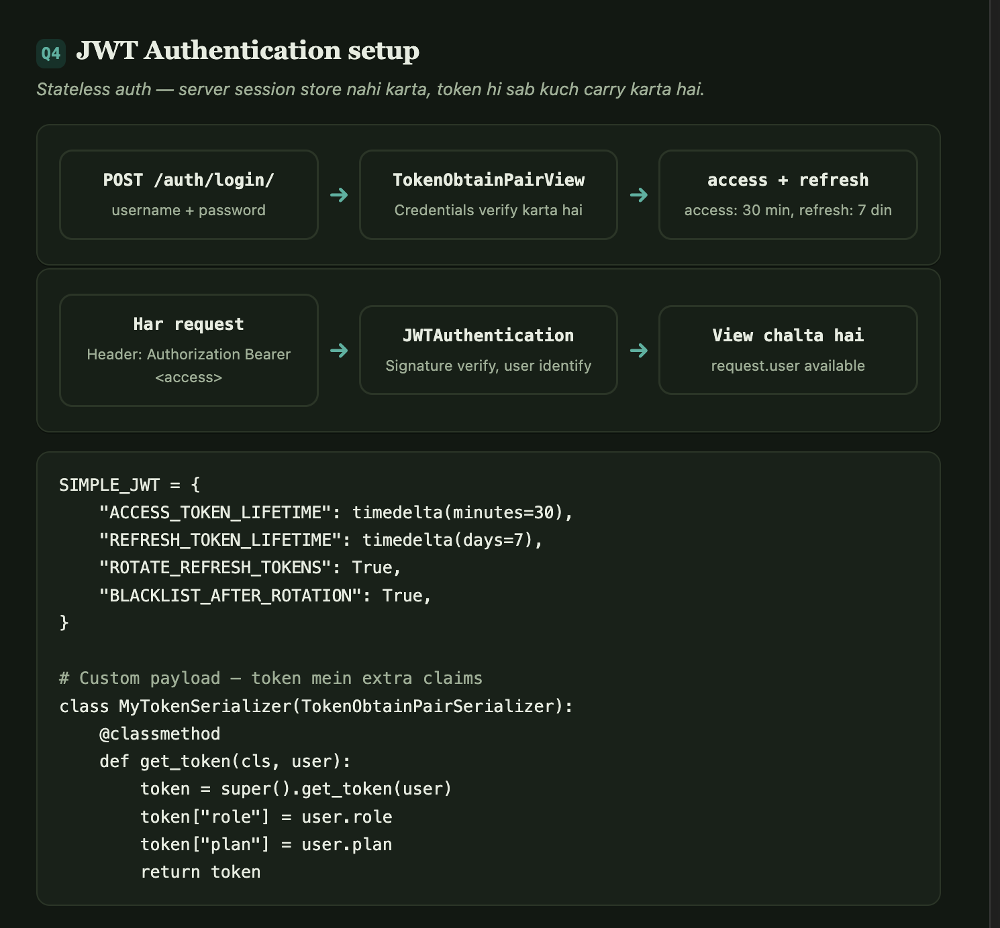
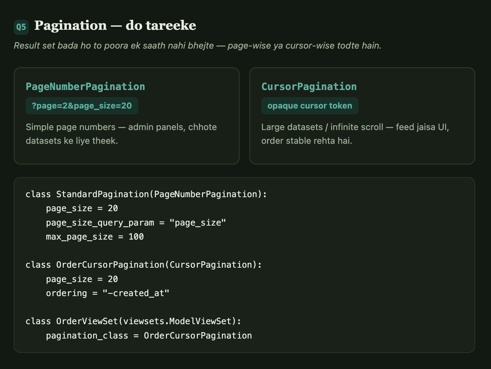
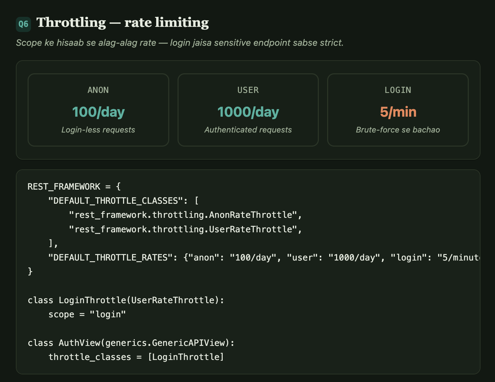

# Django REST Framework — ViewSets, Serializers, Permissions, Auth

## Quick Concepts
- **Serializer** = Python objects ↔ JSON conversion + validation
- **ViewSet** = CRUD operations ek class mein — router se URLs auto-generate
- **Permissions** = who can access what
- **Throttling** = rate limiting
- **Pagination** = large results paginate karo
- **JWT Auth** = stateless token-based authentication

---

## Interview Questions & Answers

### Q1: DRF Serializers kaise likhte hain? Validation kaise karte hain?



**Answer:**
```python
from rest_framework import serializers
from django.contrib.auth import get_user_model

User = get_user_model()

class UserSerializer(serializers.ModelSerializer):
    # Write-only field (response mein nahi aayega)
    password = serializers.CharField(write_only=True, min_length=8)
    # Computed field
    full_name = serializers.SerializerMethodField()
    # Nested serializer
    profile = ProfileSerializer(read_only=True)

    class Meta:
        model = User
        fields = ["id", "username", "email", "password", "full_name", "profile", "created_at"]
        read_only_fields = ["id", "created_at"]

    def get_full_name(self, obj) -> str:
        return f"{obj.first_name} {obj.last_name}".strip()

    # Field-level validation
    def validate_email(self, value: str) -> str:
        if User.objects.filter(email=value).exists():
            raise serializers.ValidationError("Email already registered")
        return value.lower()

    # Object-level validation (multiple fields)
    def validate(self, data: dict) -> dict:
        if data.get("password") and data.get("username") in data["password"]:
            raise serializers.ValidationError("Password cannot contain username")
        return data

    # Override create
    def create(self, validated_data: dict) -> User:
        password = validated_data.pop("password")
        user = User(**validated_data)
        user.set_password(password)  # hash karo
        user.save()
        return user

    # Override update
    def update(self, instance: User, validated_data: dict) -> User:
        password = validated_data.pop("password", None)
        for attr, value in validated_data.items():
            setattr(instance, attr, value)
        if password:
            instance.set_password(password)
        instance.save()
        return instance

# Usage
serializer = UserSerializer(data=request.data)
if serializer.is_valid(raise_exception=True):
    user = serializer.save()


### Q2: ViewSet kaise banate hain? Router se URLs kaise generate hote hain?
**Answer:**
#python




from rest_framework import viewsets, status
from rest_framework.decorators import action
from rest_framework.response import Response
from rest_framework.permissions import IsAuthenticated, IsAdminUser

class UserViewSet(viewsets.ModelViewSet):
    """
    ModelViewSet automatically provides:
    list, create, retrieve, update, partial_update, destroy
    """
    queryset = User.objects.select_related("profile").all()
    serializer_class = UserSerializer
    permission_classes = [IsAuthenticated]

    def get_queryset(self):
        # Sirf apna data dekhe user
        if self.request.user.is_staff:
            return User.objects.all()
        return User.objects.filter(id=self.request.user.id)

    def get_serializer_class(self):
        if self.action in ["create", "update"]:
            return UserCreateSerializer
        return UserSerializer

    def get_permissions(self):
        if self.action == "destroy":
            return [IsAdminUser()]
        return [IsAuthenticated()]

    # Custom action
    @action(detail=False, methods=["get"], url_path="me")
    def me(self, request):
        serializer = self.get_serializer(request.user)
        return Response(serializer.data)

    @action(detail=True, methods=["post"], url_path="activate")
    def activate(self, request, pk=None):
        user = self.get_object()
        user.is_active = True
        user.save()
        return Response({"status": "activated"})

    @action(detail=False, methods=["post"], url_path="change-password")
    def change_password(self, request):
        serializer = ChangePasswordSerializer(data=request.data)
        serializer.is_valid(raise_exception=True)
        request.user.set_password(serializer.validated_data["new_password"])
        request.user.save()
        return Response({"message": "Password changed"})

# Router
from rest_framework.routers import DefaultRouter

router = DefaultRouter()
router.register(r"users", UserViewSet, basename="user")

urlpatterns = [path("api/", include(router.urls))]

# Auto-generated URLs:
# GET    /api/users/           → list
# POST   /api/users/           → create
# GET    /api/users/{id}/      → retrieve
# PUT    /api/users/{id}/      → update
# PATCH  /api/users/{id}/      → partial_update
# DELETE /api/users/{id}/      → destroy
# GET    /api/users/me/        → me (custom action)
# POST   /api/users/{id}/activate/  → activate

### Q3: DRF Permissions kaise kaam karte hain? Custom permission kaise banate hain?
**Answer:**


from rest_framework.permissions import BasePermission, SAFE_METHODS

# Built-in permissions
# IsAuthenticated — login hona chahiye
# IsAdminUser — Django admin user hona chahiye
# IsAuthenticatedOrReadOnly — read ke liye login optional, write ke liye required

# Custom permission
class IsOwnerOrReadOnly(BasePermission):
    """Object owner hi edit kar sakta hai, baaki read only"""

    def has_object_permission(self, request, view, obj):
        if request.method in SAFE_METHODS:  # GET, HEAD, OPTIONS
            return True
        return obj.user == request.user

class IsPremiumUser(BasePermission):
    message = "Premium plan required for this feature"

    def has_permission(self, request, view):
        return (
            request.user.is_authenticated and
            request.user.plan == "premium"
        )

class IsOrganizationMember(BasePermission):
    def has_object_permission(self, request, view, obj):
        return request.user in obj.organization.members.all()

# ViewSet mein use
class PostViewSet(viewsets.ModelViewSet):
    permission_classes = [IsAuthenticated, IsOwnerOrReadOnly]

    # Action-level permissions
    @action(detail=False, permission_classes=[IsPremiumUser])
    def export(self, request):
        ...


### Q4: JWT Authentication DRF mein kaise setup karte hain?
**Answer:**
pip install djangorestframework-simplejwt



# settings.py
REST_FRAMEWORK = {
    "DEFAULT_AUTHENTICATION_CLASSES": [
        "rest_framework_simplejwt.authentication.JWTAuthentication",
    ],
    "DEFAULT_PERMISSION_CLASSES": [
        "rest_framework.permissions.IsAuthenticated",
    ],
}

from datetime import timedelta
SIMPLE_JWT = {
    "ACCESS_TOKEN_LIFETIME": timedelta(minutes=30),
    "REFRESH_TOKEN_LIFETIME": timedelta(days=7),
    "ROTATE_REFRESH_TOKENS": True,
    "BLACKLIST_AFTER_ROTATION": True,
    "ALGORITHM": "HS256",
    "SIGNING_KEY": SECRET_KEY,
}

# urls.py
from rest_framework_simplejwt.views import TokenObtainPairView, TokenRefreshView

urlpatterns += [
    path("auth/login/", TokenObtainPairView.as_view()),    # POST → access + refresh
    path("auth/refresh/", TokenRefreshView.as_view()),     # POST → new access token
]

# Custom JWT payload
from rest_framework_simplejwt.serializers import TokenObtainPairSerializer

class MyTokenSerializer(TokenObtainPairSerializer):
    @classmethod
    def get_token(cls, user):
        token = super().get_token(user)
        token["name"] = user.get_full_name()
        token["role"] = user.role
        token["plan"] = user.plan
        return token


### Q5: DRF Pagination kaise karte hain?
**Answer:**



# settings.py
REST_FRAMEWORK = {
    "DEFAULT_PAGINATION_CLASS": "rest_framework.pagination.PageNumberPagination",
    "PAGE_SIZE": 20,
}

# Custom pagination
from rest_framework.pagination import PageNumberPagination, CursorPagination

class StandardPagination(PageNumberPagination):
    page_size = 20
    page_size_query_param = "page_size"
    max_page_size = 100

    def get_paginated_response(self, data):
        return Response({
            "count": self.page.paginator.count,
            "total_pages": self.page.paginator.num_pages,
            "next": self.get_next_link(),
            "previous": self.get_previous_link(),
            "results": data,
        })

# Cursor pagination (large datasets, infinite scroll)
class OrderCursorPagination(CursorPagination):
    page_size = 20
    ordering = "-created_at"

class OrderViewSet(viewsets.ModelViewSet):
    pagination_class = OrderCursorPagination


### Q6: DRF Throttling (Rate Limiting) kaise karte hain?
**Answer:**

# settings.py
REST_FRAMEWORK = {
    "DEFAULT_THROTTLE_CLASSES": [
        "rest_framework.throttling.AnonRateThrottle",
        "rest_framework.throttling.UserRateThrottle",
    ],
    "DEFAULT_THROTTLE_RATES": {
        "anon": "100/day",
        "user": "1000/day",
        "login": "5/minute",   # strict login throttle
    },
}

# Custom throttle
from rest_framework.throttling import UserRateThrottle

class LoginThrottle(UserRateThrottle):
    scope = "login"

class AuthView(generics.GenericAPIView):
    throttle_classes = [LoginThrottle]

    def post(self, request):
        # login logic
        ...
```
