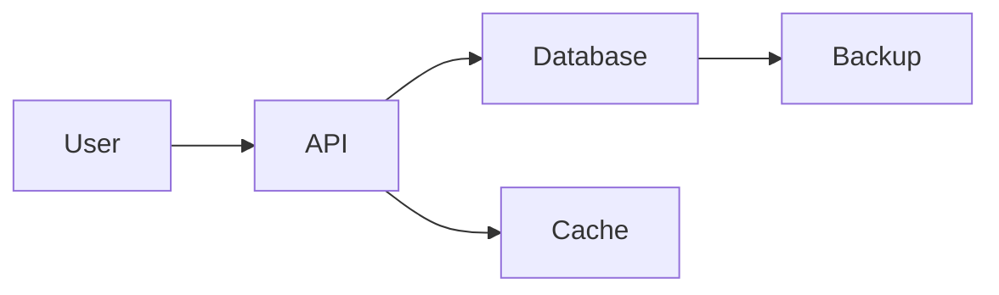

# Documentation — Sphinx, MkDocs, Docstrings, Type Stubs

## Quick Concepts

**WHAT:**
- **Sphinx** = Classic Python documentation generator
- **MkDocs** = Modern Markdown-based docs
- **MkDocs Material** = Beautiful theme for MkDocs
- **Docstrings** = Inline documentation (PEP 257)
- **Type stubs (.pyi)** = Type-only files for libraries
- **Google/NumPy/Sphinx styles** = Docstring formats
- **Read the Docs** = Free hosting for OSS docs

**WHY docs matter:**
- Onboarding new devs
- API reference
- Avoid answering same questions
- OSS adoption requires docs

---

## Interview Questions & Answers

### Q1: Docstring formats — Google vs NumPy vs Sphinx?

**Answer:**

**HOW — Google style (most popular):**

```python
def calculate_total(items: list, tax_rate: float = 0.08) -> float:
    """Calculate total price with tax.

    Args:
        items: List of items with 'price' attribute.
        tax_rate: Tax rate as decimal (default 0.08 = 8%).

    Returns:
        Total price including tax.

    Raises:
        ValueError: If tax_rate is negative.

    Example:
        >>> items = [Item(price=10), Item(price=20)]
        >>> calculate_total(items, tax_rate=0.10)
        33.0
    """
    if tax_rate < 0:
        raise ValueError("Tax rate must be non-negative")

    subtotal = sum(item.price for item in items)
    return subtotal * (1 + tax_rate)
```

**HOW — NumPy style:**

```python
def calculate_total(items, tax_rate=0.08):
    """Calculate total price with tax.

    Parameters
    ----------
    items : list of Item
        Items with 'price' attribute.
    tax_rate : float, optional
        Tax rate as decimal, by default 0.08.

    Returns
    -------
    float
        Total price including tax.

    Raises
    ------
    ValueError
        If tax_rate is negative.

    Examples
    --------
    >>> calculate_total([Item(price=10)], tax_rate=0.10)
    11.0
    """
    pass
```

**HOW — Sphinx (reStructuredText):**

```python
def calculate_total(items, tax_rate=0.08):
    """Calculate total price with tax.

    :param items: List of items with 'price' attribute.
    :type items: list
    :param tax_rate: Tax rate as decimal.
    :type tax_rate: float
    :returns: Total price including tax.
    :rtype: float
    :raises ValueError: If tax_rate is negative.
    """
    pass
```

**Recommendation:** **Google style** — most popular, supported everywhere.

---

### Q2: Sphinx — full setup?

**Answer:**

**WHAT:** Classic Python doc generator (originally for Python itself).

**HOW — Install + initialize:**

```bash
# Install
pip install sphinx sphinx-rtd-theme sphinx-autodoc-typehints myst-parser

# Initialize in docs/ folder
mkdir docs
cd docs
sphinx-quickstart
# Answers: project name, author, etc.
```

**HOW — conf.py (Sphinx config):**

```python
# docs/conf.py
import os
import sys

# Add project to path
sys.path.insert(0, os.path.abspath("../src"))

project = "MyApp"
author = "Alice Smith"
release = "1.0.0"

extensions = [
    "sphinx.ext.autodoc",          # ⭐ Generate from docstrings
    "sphinx.ext.napoleon",          # ⭐ Google/NumPy style support
    "sphinx.ext.viewcode",          # Link to source
    "sphinx.ext.intersphinx",       # Link to other projects
    "sphinx_autodoc_typehints",    # Type hints in docs
    "myst_parser",                  # ⭐ Markdown support
]

# Theme
html_theme = "sphinx_rtd_theme"  # or "furo", "sphinx_book_theme"

# Napoleon
napoleon_google_docstring = True
napoleon_numpy_docstring = False
napoleon_include_init_with_doc = True

# Type hints
autodoc_typehints = "description"
```

**HOW — Auto-generate docs from code:**

```rst
.. docs/api.rst

API Reference
=============

.. automodule:: myapp.core
   :members:
   :undoc-members:
   :show-inheritance:

.. autoclass:: myapp.models.User
   :members:
   :inherited-members:

.. autofunction:: myapp.utils.calculate_total
```

**HOW — Build:**

```bash
cd docs
sphinx-build -b html source build

# Or with make
make html

# View
open build/html/index.html
```

---

### Q3: MkDocs Material — modern alternative?

**Answer:**

**WHAT:** Markdown-based docs with beautiful Material Design theme.

**WHY over Sphinx:**
- ✅ Markdown (easier than rST)
- ✅ Beautiful out-of-box
- ✅ Fast (Material theme)
- ✅ Easy to customize
- ✅ Built-in search

**HOW — Setup:**

```bash
pip install mkdocs-material

# Initialize
mkdocs new myproject
cd myproject
```

**HOW — mkdocs.yml:**

```yaml
# mkdocs.yml
site_name: My Awesome Docs
site_url: https://docs.example.com
repo_url: https://github.com/me/myapp
repo_name: me/myapp

theme:
  name: material
  features:
    - navigation.tabs
    - navigation.sections
    - navigation.expand
    - navigation.top
    - search.suggest
    - search.highlight
    - content.code.copy
    - content.code.annotate
  palette:
    - scheme: default
      primary: indigo
      toggle:
        icon: material/weather-sunny
        name: Switch to dark mode
    - scheme: slate
      primary: indigo
      toggle:
        icon: material/weather-night
        name: Switch to light mode
  icon:
    repo: fontawesome/brands/github

plugins:
  - search
  - mkdocstrings:                  # ⭐ Auto-generate from code
      handlers:
        python:
          options:
            docstring_style: google
            show_source: true

markdown_extensions:
  - admonition
  - pymdownx.highlight
  - pymdownx.superfences
  - pymdownx.tabbed:
      alternate_style: true
  - pymdownx.tasklist:
      custom_checkbox: true
  - tables

nav:
  - Home: index.md
  - Quickstart: quickstart.md
  - User Guide:
      - Installation: guide/installation.md
      - Usage: guide/usage.md
  - API Reference:
      - Core: api/core.md
      - Models: api/models.md
  - Changelog: changelog.md
```

**HOW — Auto-generate API docs:**

```markdown
<!-- docs/api/core.md -->
# Core Module

::: myapp.core
    options:
      members:
        - calculate_total
        - process_items
```

This generates docs from docstrings automatically!

**HOW — Build + serve:**

```bash
# Live preview
mkdocs serve
# Open http://localhost:8000

# Build static
mkdocs build
# Output: site/

# Deploy to GitHub Pages
mkdocs gh-deploy
```

---

### Q4: pdoc — simpler alternative?

**Answer:**

**WHAT:** Zero-config API doc generator.

**HOW:**

```bash
pip install pdoc

# Generate
pdoc myapp -o docs/
# Or serve live
pdoc myapp

# Done — no config needed!
```

**WHEN:**
- Quick API reference
- Simple projects
- No tutorial content needed

---

### Q5: Read the Docs — free hosting?

**Answer:**

**WHAT:** Free hosting for OSS docs.

**HOW:**

```bash
# 1. Sign up at https://readthedocs.org
# 2. Connect GitHub
# 3. Select repo
```

**HOW — .readthedocs.yaml:**

```yaml
# .readthedocs.yaml
version: 2

build:
  os: ubuntu-22.04
  tools:
    python: "3.12"

# For Sphinx
sphinx:
  configuration: docs/conf.py

# For MkDocs
mkdocs:
  configuration: mkdocs.yml

python:
  install:
    - requirements: docs/requirements.txt
    - method: pip
      path: .

formats:
  - htmlzip
  - pdf
```

**HOW — Docs requirements:**

```txt
# docs/requirements.txt
mkdocs-material
mkdocstrings[python]
```

---

### Q6: Type stubs (.pyi) — what + how?

**Answer:**

**WHAT:** Type-only files for type checkers (mypy, pyright).

**WHY:**
- Add types to library without modifying source
- Distribute types separately
- Document expected types

**HOW — Inline (preferred):**

```python
# myapp/core.py
def add(x: int, y: int) -> int:
    return x + y
# ⭐ Types in source file
```

**HOW — Separate .pyi:**

```python
# myapp/core.py (no types)
def add(x, y):
    return x + y


# myapp/core.pyi (types only)
def add(x: int, y: int) -> int: ...
```

**HOW — Distribute typed package (PEP 561):**

```python
# Create marker file
echo "" > myapp/py.typed

# pyproject.toml — include marker
[tool.hatch.build.targets.wheel]
packages = ["src/myapp"]
include = ["src/myapp/py.typed"]
```

**HOW — Use type stubs for 3rd party:**

```bash
# Install stubs for libraries
pip install types-requests
pip install types-redis
pip install types-PyYAML

# mypy now knows types
```

**HOW — Generate stubs from code:**

```bash
# Auto-generate
stubgen -p myapp -o stubs/

# Output: stubs/myapp/*.pyi
```

---

### Q7: Auto-doc from FastAPI / Pydantic?

**Answer:**

**WHAT:** FastAPI auto-generates OpenAPI from code.

**HOW — FastAPI's built-in docs:**

```python
from fastapi import FastAPI
from pydantic import BaseModel, Field

app = FastAPI(
    title="My API",
    description="Awesome API docs",
    version="1.0.0",
)


class User(BaseModel):
    """User model."""
    id: int = Field(..., description="User ID")
    name: str = Field(..., description="Full name")
    email: str = Field(..., description="Email address")


@app.get("/users/{user_id}", response_model=User, tags=["users"])
async def get_user(user_id: int):
    """Get user by ID.

    Args:
        user_id: The user's ID

    Returns:
        User details

    Raises:
        404: If user not found
    """
    return User(id=user_id, name="Alice", email="a@x.com")


# ⭐ Auto-generated:
# - http://localhost:8000/docs (Swagger UI)
# - http://localhost:8000/redoc (Redoc)
# - http://localhost:8000/openapi.json (OpenAPI spec)
```

**HOW — Export OpenAPI:**

```python
import json
from myapp.main import app

with open("openapi.json", "w") as f:
    json.dump(app.openapi(), f, indent=2)
```

---

### Q8: Doctest — tests in docstrings?

**Answer:**

**WHAT:** Embed runnable examples in docstrings.

**WHY:**
- Examples always work (auto-tested)
- Documentation IS test

**HOW:**

```python
def add(x: int, y: int) -> int:
    """Add two numbers.

    Examples:
        >>> add(2, 3)
        5

        >>> add(-1, 1)
        0

        >>> add(0, 0)
        0
    """
    return x + y


# Run doctests
# python -m doctest mymodule.py -v
```

**HOW — With pytest:**

```bash
# Run doctests with pytest
pytest --doctest-modules
```

```toml
# pyproject.toml
[tool.pytest.ini_options]
addopts = "--doctest-modules"
```

---

### Q9: Diagram-as-Code in docs?

**Answer:**

**HOW — Mermaid:**

```markdown
<!-- In MkDocs Material -->


```

**HOW — PlantUML:**

```markdown
<!-- In Sphinx with plantuml extension -->

.. uml::

    Alice -> Bob: Authentication Request
    Bob --> Alice: Authentication Response
```

**HOW — Excalidraw (interactive):**

```markdown

```

---

### Q10: Documentation best practices?

**Answer:**

**HOW — Four types of docs (Divio):**

```
1. TUTORIALS - Learning-oriented
   "Get started in 5 minutes"
   - Hand-holding
   - Build something concrete

2. HOW-TO GUIDES - Goal-oriented
   "How to authenticate users"
   - Specific recipes
   - Practical solutions

3. REFERENCE - Information-oriented
   "API Reference"
   - Auto-generated from code
   - Complete + accurate

4. EXPLANATION - Understanding-oriented
   "Architecture overview"
   - The "why" behind design
   - Background context
```

**HOW — Project documentation structure:**

```
docs/
├── index.md                # Landing page
├── quickstart.md           # 5-minute intro
├── tutorial/               # Learning
│   ├── 01-installation.md
│   ├── 02-first-app.md
│   └── 03-deploy.md
├── how-to/                 # Recipes
│   ├── auth.md
│   ├── deploy.md
│   └── monitor.md
├── reference/              # API
│   ├── core.md             # Auto-gen
│   └── api.md
└── explanation/            # Deep dives
    ├── architecture.md
    └── design-decisions.md
```

---

## Documentation Toolchain

| Tool | Purpose |
|---|---|
| **MkDocs Material** | Modern docs (recommended) |
| **Sphinx + RTD theme** | Classic Python docs |
| **pdoc** | Quick API docs |
| **mkdocstrings** | API from docstrings (MkDocs) |
| **autodoc** | API from docstrings (Sphinx) |
| **Read the Docs** | Free hosting |
| **GitHub Pages** | Free hosting (mkdocs gh-deploy) |
| **Doctest** | Runnable examples |
| **Sphinx-autoapi** | Auto package docs |

---

## Documentation Checklist

```markdown
### Code Documentation
- [ ] Every public function has docstring
- [ ] Every class has docstring
- [ ] Use consistent style (Google recommended)
- [ ] Include type hints
- [ ] Examples in docstrings (doctest)

### Project Documentation
- [ ] README.md (clear quickstart)
- [ ] CHANGELOG.md (version history)
- [ ] CONTRIBUTING.md (for OSS)
- [ ] LICENSE
- [ ] CODE_OF_CONDUCT.md (for OSS)

### Generated Docs
- [ ] MkDocs or Sphinx configured
- [ ] API reference auto-generated
- [ ] Tutorials for new users
- [ ] How-to guides
- [ ] Deployed (RTD or gh-pages)

### Quality
- [ ] No broken links (sphinx-lint)
- [ ] Spell-checked
- [ ] Code examples run (doctest)
- [ ] Updated with each release
- [ ] Search works
```

---

## Sample README Template

```markdown
# Project Name

[](https://github.com/me/myapp/actions)
[](https://codecov.io/gh/me/myapp)
[](https://pypi.org/project/myapp/)
[](LICENSE)

One-line description.

## Features

- 🚀 Feature 1
- 🔥 Feature 2
- 💎 Feature 3

## Installation

```bash
pip install myapp
```

## Quickstart

```python
from myapp import App

app = App()
app.run()
```

## Documentation

Full docs: https://myapp.readthedocs.io

## Contributing

See CONTRIBUTING.md

## License

MIT
```
