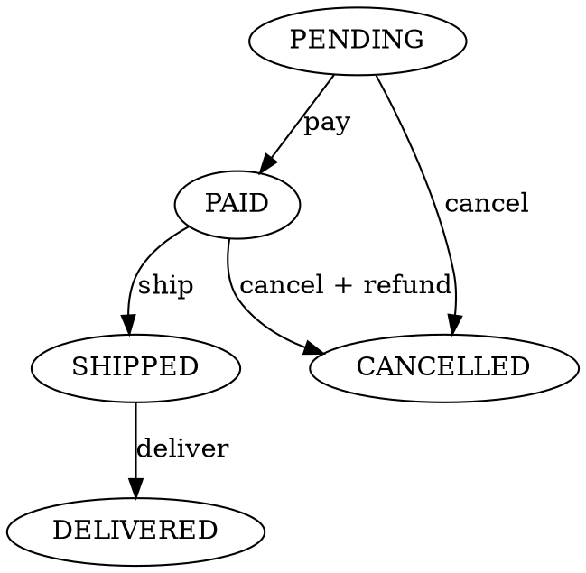

# 18 — State Pattern

> Behavioral design pattern. Lets an object alter its behavior when its internal state changes. The object appears to change its class.

---

## When to use

You have an object whose behavior depends on what state it's in, and the state-dependent logic is scattered across many methods full of `if/else` or `switch` statements.

### Symptoms screaming for State pattern
```python
class Order:
    def __init__(self):
        self.status = "pending"

    def pay(self):
        if self.status == "pending":
            self.status = "paid"
        elif self.status == "paid":
            raise Exception("Already paid")
        elif self.status == "cancelled":
            raise Exception("Order cancelled")
        # ... more states added over time

    def ship(self):
        if self.status == "paid":
            self.status = "shipped"
        elif self.status == "pending":
            raise Exception("Pay first")
        # ... etc

    def cancel(self):
        if self.status == "pending":
            self.status = "cancelled"
        elif self.status == "shipped":
            raise Exception("Can't cancel shipped order")
        # ... etc
```

After 5 states and 6 actions, this code becomes a maze.

---

## Structure

```
┌─────────────┐         ┌──────────────┐
│  Context    │ ──────► │   State       │  (abstract)
│             │         │  + handle()   │
│ - state     │         └──────┬───────┘
│ + request() │                │
└─────────────┘     ┌──────────┼──────────┐
                    │          │          │
              ┌─────▼───┐  ┌───▼────┐  ┌──▼────┐
              │ StateA  │  │ StateB │  │StateC │
              │+handle()│  │+handle()│ │+handle()│
              └─────────┘  └────────┘  └───────┘
```

- **Context**: holds reference to current state; delegates state-specific behavior to it.
- **State**: interface defining state-specific operations.
- **Concrete States**: implement behavior for each state, and may trigger transitions by updating Context's state reference.

---

## Implementation — Order State Machine

```python
from abc import ABC, abstractmethod

# State interface
class OrderState(ABC):
    @abstractmethod
    def pay(self, order):    pass
    @abstractmethod
    def ship(self, order):   pass
    @abstractmethod
    def cancel(self, order): pass
    @abstractmethod
    def deliver(self, order):pass


# Concrete States
class PendingState(OrderState):
    def pay(self, order):
        print("Payment received")
        order.state = PaidState()

    def ship(self, order):
        raise InvalidTransition("Cannot ship before payment")

    def cancel(self, order):
        print("Order cancelled")
        order.state = CancelledState()

    def deliver(self, order):
        raise InvalidTransition("Not shipped yet")


class PaidState(OrderState):
    def pay(self, order):
        raise InvalidTransition("Already paid")

    def ship(self, order):
        print("Order shipped")
        order.state = ShippedState()

    def cancel(self, order):
        print("Order cancelled with refund")
        # process refund
        order.state = CancelledState()

    def deliver(self, order):
        raise InvalidTransition("Not shipped yet")


class ShippedState(OrderState):
    def pay(self, order):
        raise InvalidTransition("Already paid")

    def ship(self, order):
        raise InvalidTransition("Already shipped")

    def cancel(self, order):
        raise InvalidTransition("Cannot cancel shipped order")

    def deliver(self, order):
        print("Order delivered")
        order.state = DeliveredState()


class DeliveredState(OrderState):
    def pay(self, order):    raise InvalidTransition("Final state")
    def ship(self, order):   raise InvalidTransition("Final state")
    def cancel(self, order): raise InvalidTransition("Cannot cancel delivered order")
    def deliver(self, order):raise InvalidTransition("Already delivered")


class CancelledState(OrderState):
    def pay(self, order):    raise InvalidTransition("Order cancelled")
    def ship(self, order):   raise InvalidTransition("Order cancelled")
    def cancel(self, order): raise InvalidTransition("Already cancelled")
    def deliver(self, order):raise InvalidTransition("Order cancelled")


class InvalidTransition(Exception):
    pass


# Context
class Order:
    def __init__(self):
        self.state: OrderState = PendingState()

    def pay(self):    self.state.pay(self)
    def ship(self):   self.state.ship(self)
    def cancel(self): self.state.cancel(self)
    def deliver(self):self.state.deliver(self)


# Usage
order = Order()
order.pay()       # "Payment received"
order.ship()      # "Order shipped"
order.deliver()   # "Order delivered"
# order.cancel()  # Raises: Cannot cancel delivered order
```

---

## Benefits

### 1. Single Responsibility
Each state's logic is in its own class. Easy to read, easy to test.

### 2. Open/Closed Principle
Add new state? Create new class. No editing existing states.

### 3. Eliminates massive if/else
Replaces conditional branching with polymorphic dispatch.

### 4. State transitions are explicit
You see exactly which state can transition to which.

---

## Trade-offs

### Pros
- ✓ Clear state-specific behavior.
- ✓ Easy to add new states.
- ✓ Each state independently testable.

### Cons
- ✗ More classes (5 states → 5 classes).
- ✗ Over-engineering for simple state machines.
- ✗ Can be confusing for newcomers expecting if/else.

---

## When NOT to use

- 2-3 states with simple transitions: just use enum + if/else.
- States with very similar logic: code duplication risk.
- Frequently changing state graph: each change touches many files.

---

## Variants

### Singleton states
If states are pure logic (no per-instance state), make them singletons:

```python
class PaidState(OrderState):
    _instance = None
    def __new__(cls):
        if cls._instance is None:
            cls._instance = super().__new__(cls)
        return cls._instance
```

Saves memory.

### State enum + handler map
For simple cases, replace classes with enum + handler dict:

```python
from enum import Enum

class Status(Enum):
    PENDING = "pending"
    PAID = "paid"
    SHIPPED = "shipped"

TRANSITIONS = {
    (Status.PENDING, "pay"):  Status.PAID,
    (Status.PAID, "ship"):    Status.SHIPPED,
}

def transition(current, event):
    next_state = TRANSITIONS.get((current, event))
    if next_state is None:
        raise InvalidTransition()
    return next_state
```

Less ceremony for small state machines.

### State with side effects

```python
class PaidState(OrderState):
    def __init__(self, order):
        # On entry to this state, send email
        send_email(order.user, "Payment received")

    def cancel(self, order):
        process_refund(order)
        order.state = CancelledState(order)
```

---

## Real-World Examples

### TCP Connection
States: CLOSED → SYN_SENT → ESTABLISHED → FIN_WAIT → ...
Each state has rules about which packets it accepts.

### Vending Machine
States: NO_COIN → COIN_INSERTED → PRODUCT_SELECTED → DISPENSING.

### Game Character AI
States: IDLE → PATROLLING → CHASING → ATTACKING → DEAD.

### Document Workflow
States: DRAFT → REVIEW → APPROVED → PUBLISHED → ARCHIVED.

### Order/Payment Processing
States: PENDING → PAID → SHIPPED → DELIVERED (or CANCELLED, REFUNDED).

### UI Components
React/Vue components have implicit state pattern (state-driven render).

---

## State Pattern vs Strategy Pattern

Both swap behavior via composition. Differences:

| State | Strategy |
|---|---|
| Multiple behaviors via state transitions | Multiple algorithms for same task |
| States know about transitions | Strategies are independent |
| Context lifecycle | Context is unaware |
| Time-based | Choice-based |

State: "I am now A; I might become B."
Strategy: "Use algorithm A this time, B next time."

---

## State Pattern in Database (Persisted)

For real systems, state lives in DB. Pattern adapts:

```python
class Order:
    def __init__(self, db_row):
        self.id = db_row.id
        self.status = db_row.status     # 'pending', 'paid', ...
        self.state = self._load_state()

    def _load_state(self):
        return {
            "pending": PendingState(),
            "paid":    PaidState(),
            ...
        }[self.status]

    def pay(self):
        self.state.pay(self)
        self.status = type(self.state).__name__.replace("State", "").lower()
        save_to_db(self)
```

Or use a state machine library:
- `transitions` (Python, very popular).
- `xstate` (JS).

---

## State Machine Library Example (Python `transitions`)

```python
from transitions import Machine

class Order:
    states = ["pending", "paid", "shipped", "delivered", "cancelled"]
    transitions = [
        {"trigger": "pay",     "source": "pending", "dest": "paid"},
        {"trigger": "ship",    "source": "paid",    "dest": "shipped"},
        {"trigger": "deliver", "source": "shipped", "dest": "delivered"},
        {"trigger": "cancel",  "source": ["pending", "paid"], "dest": "cancelled"},
    ]

    def __init__(self):
        self.machine = Machine(model=self, states=self.states,
                              transitions=self.transitions, initial="pending")

o = Order()
o.pay()       # state → 'paid'
o.ship()      # state → 'shipped'
# o.pay()     # raises (invalid transition from 'shipped')
```

90% of the State pattern's value with 10% of the code.

---

## Testing State Transitions

```python
def test_paid_to_shipped_succeeds():
    order = Order()
    order.pay()
    order.ship()
    assert order.status == "shipped"

def test_cannot_ship_pending():
    order = Order()
    with pytest.raises(InvalidTransition):
        order.ship()

def test_state_machine_graph():
    """Verify every transition explicitly defined or forbidden."""
    valid_transitions = {("pending", "pay"), ("paid", "ship"), ...}
    for state in ALL_STATES:
        for event in ALL_EVENTS:
            order = make_order(state)
            try:
                order.event()
                assert (state, event) in valid_transitions
            except InvalidTransition:
                assert (state, event) not in valid_transitions
```

---

## Visualizing State Machines

Use Graphviz or PlantUML:



Some libraries (transitions, xstate) auto-generate diagrams.

---

## Interview Tips

When asked "design a [stateful entity]":
1. List all states.
2. Draw transition diagram.
3. Pick pattern: enum + dict for simple, full State pattern for complex.
4. Show invalid-transition handling.
5. Show persistence (state column in DB).
6. Mention library option (transitions / xstate) as production choice.

---

## TL;DR

- State pattern = polymorphism instead of if/else for stateful behavior.
- Each state = own class.
- Transitions explicit and centralized.
- For simple state machines: enum + dict suffices.
- For real systems: use a library + DB persistence.
- **Pattern shows up in:** workflows, finite-state systems, protocol stacks, UI state.
