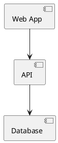
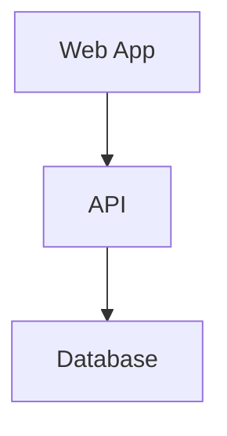

# Lecture 5: Documenting Architecture — ADRs, C4 Diagrams & Best Practices

> *"Good documentation tells the why and the what."*

**Section 1 — Foundations of Software Architecture**

---

## 🎯 Is lecture mein kya seekhenge?

- **Architecture document karna kyun zaroori** hai?
- **Architecture Decision Records (ADRs)** — kya hain, kab aur kaise likhe?
- **C4 Model** — 4 levels of architectural diagrams
  - **Level 1: Context** — Big picture
  - **Level 2: Container** — Major building blocks
  - **Level 3: Component** — Inside a container
  - **Level 4: Code** — Class diagrams (optional)
- **Tools** — Structurizr, PlantUML, Mermaid, Draw.io
- **Best practices** for living documentation

---

## 1. Architecture Document Karna Kyun Zaroori Hai?

### The Common Mistake

> **"Writing code is not enough?"**

Imagine yeh scenarios:
- Aap new team join karte ho. Koi documentation nahi. **Why** kuch chose hua, **kyun** kuch decide hua — kuch pata nahi.
- 2 saal pehle ki ADR padhne ki koshish karte ho. Slack messages lost ho gaye. Email purane ho gaye.
- Audit ke time pe **compliance** show karna hai. Aapke paas kuch bhi formal nahi hai.

### Why Documentation Matters

```
        ┌──────────────────────────────────┐
        │   📚 Documentation Benefits        │
        └──────────────┬──────────────────┘
                       │
        ┌──────────────┼────────────────┐
        ▼              ▼                ▼
┌──────────────┐ ┌────────────┐ ┌──────────────┐
│ Decisions     │ │ Faster      │ │ Better        │
│ visible &     │ │ onboarding  │ │ collaboration │
│ traceable     │ │             │ │ & reviews     │
└──────────────┘ └────────────┘ └──────────────┘
                       │
                       ▼
              ┌──────────────────┐
              │ Audits, scaling,  │
              │ smooth handovers  │
              └──────────────────┘
```

### Concrete Benefits

**1. Decisions Visible and Traceable**
- "Why did we choose PostgreSQL over MongoDB 2 years ago?"
- Without docs: **Nobody remembers**
- With ADRs: **Documented reasoning, easily referenced**

**2. Faster Onboarding**
- New developer joins team
- Without docs: 4 weeks asking questions, trial-and-error
- With docs: 1 week to ramp up

**3. Better Collaboration**
- During architecture review
- Without docs: Repeated discussions on same topics
- With docs: "See ADR-007 — we already discussed this"

**4. Compliance & Audits**
- SOC 2, GDPR, ISO certifications need documentation
- Without docs: Scramble during audit
- With docs: Show certification team the documents

**5. Future Planning**
- "Should we still use this architecture?"
- Without docs: No context for decision
- With docs: "Original decision was for X reason. Has X changed?"

### Key Insight

> **Good documentation is a multiplier. It saves time, reduces friction, and future-proofs your decisions.**

---

## 2. Architecture Decision Records (ADRs)

### What is an ADR?

> **ADRs are lightweight documents that capture the WHY behind important technical decisions.**

They're NOT:
- ❌ Full-blown specs (overkill)
- ❌ Daily code reviews (too granular)
- ❌ Marketing material (not why this matters)

They ARE:
- ✅ Design snapshots
- ✅ Decision context
- ✅ Decision rationale
- ✅ Trade-off documentation

### ADR Visual Concept

```
┌────────────────────────────┐
│                            │
│   Architecture             │
│   Decision                 │
│   Record                   │
│                            │
└────────────────────────────┘
   (Lightweight markdown doc)
```

### Why ADRs?

```
Without ADRs:
─────────────
Q: "Why did we use JWT instead of sessions?"
A: "I think... someone decided that 3 years ago.
    Maybe Rajesh? He's left now. Check his old emails?"

With ADRs:
──────────
Q: "Why did we use JWT instead of sessions?"
A: "See ADR-005-JWT-vs-Sessions. Decision was for
    stateless auth to support mobile clients and easier
    horizontal scaling. Trade-off: cannot easily revoke tokens."
```

### Common Decision Examples

```
Decisions that DESERVE an ADR:
─────────────────────────────
✅ "Use PostgreSQL instead of MongoDB"
✅ "Use JWT instead of session-based auth"
✅ "Use Kafka instead of RabbitMQ for events"
✅ "Use microservices architecture"
✅ "Use AWS Lambda for image processing"
✅ "Use Stripe instead of building own payments"
✅ "Use React instead of Vue"

Decisions that DON'T need an ADR:
─────────────────────────────
❌ "Variable naming convention"
❌ "How many spaces for indentation"
❌ "Which assertion library"
❌ Minor refactorings
```

**Rule of thumb:** If you'll be asked "why" 6 months later, write an ADR.

---

## 3. ADR Structure / Template

### Standard ADR Sections

```
┌────────────────────────────────────────────────┐
│ ADR-007: Use PostgreSQL Instead of MongoDB      │
├────────────────────────────────────────────────┤
│                                                 │
│ Status: Accepted                                │
│ Date: 2026-05-26                                │
│ Participants: Ashish, Priya, Rajesh             │
│                                                 │
│ Context:                                        │
│ We need to choose a primary DB for the order    │
│ service. Expected scale: 100K orders/day,       │
│ growing 50% YoY. Strong ACID needs.             │
│                                                 │
│ Decision:                                       │
│ We will use PostgreSQL as primary DB.           │
│                                                 │
│ Alternatives Considered:                        │
│ • MongoDB: rejected (lack of ACID transactions)│
│ • DynamoDB: rejected (vendor lock-in)           │
│ • CockroachDB: rejected (operational complexity)│
│                                                 │
│ Consequences:                                   │
│ + ACID guarantees for orders                    │
│ + Mature ecosystem, lots of expertise           │
│ + Easy local development                        │
│ - Vertical scaling limits at 50TB single DB     │
│ - Need to plan for sharding if 10x growth       │
│                                                 │
└────────────────────────────────────────────────┘
```

### Section-by-Section Breakdown

#### Title
**Format:** Clear, descriptive title

```
✅ Good:
- "ADR-005: Use JWT for User Authentication"
- "ADR-012: Adopt Kafka for Event Streaming"

❌ Bad:
- "Decision about auth"
- "Things we discussed"
```

#### Status

**Lifecycle states:**
```
proposed → accepted → deprecated/superseded
```

- **Proposed**: Under discussion, not yet decided
- **Accepted**: Decision made, in effect
- **Deprecated**: No longer in use, but still relevant for history
- **Superseded by ADR-XXX**: Replaced by newer decision

#### Date

When was the decision made? Important for context evolution.

#### Context

What led to this decision?
- What problem are we solving?
- What constraints exist?
- What requirements are driving this?

**Example:**
```
We need to choose a primary DB for the order service.
- Expected scale: 100K orders/day, growing 50% YoY
- ACID guarantees critical (financial transactions)
- Team has 5+ years PostgreSQL experience
- Compliance requires data residency in India
```

#### Decision

The actual choice made.

**Example:**
```
We will use PostgreSQL 16 as the primary DB,
deployed in AWS RDS Multi-AZ in ap-south-1.
```

#### Alternatives Considered

What other options were on the table? Why were they rejected?

**Example:**
```
- MongoDB: rejected (lacks ACID transactions)
- DynamoDB: rejected (vendor lock-in, regional limits)
- CockroachDB: rejected (operational complexity for team)
```

#### Consequences

What does this decision change? What's impacted?

**Positive (+):**
- Strong ACID guarantees
- Team expertise leveraged
- Easy local development

**Negative (-):**
- Vertical scaling limits
- Need sharding plan at 10x growth

**Risks:**
- Single-region failure mode
- Migration complexity if requirements change

#### Participants

Who was involved in this decision? Important for accountability.

### Full ADR Template (Markdown)

```markdown
# ADR-{NUMBER}: {Decision Title}

## Status
{Proposed | Accepted | Deprecated | Superseded by ADR-XXX}

## Date
YYYY-MM-DD

## Participants
- Name 1
- Name 2

## Context
What led to this decision? What problem are we solving?
What requirements/constraints exist?

## Decision
The actual choice we made.

## Alternatives Considered
- Option A: rejected because X
- Option B: rejected because Y
- Option C: considered seriously, but X tipped balance

## Consequences

### Positive
- Benefit 1
- Benefit 2

### Negative
- Drawback 1
- Drawback 2

### Risks
- Risk 1 and mitigation
- Risk 2 and mitigation

## Notes
Any additional context, links, references.
```

---

## 4. ADR Best Practices

### 1. Number Your ADRs

Sequential numbering:
```
ADR-001-record-architecture-decisions.md
ADR-002-use-postgresql-for-orders.md
ADR-003-use-jwt-for-authentication.md
ADR-004-use-kafka-for-events.md
```

### 2. Keep Them Short

```
Good ADR length: 1-2 pages
Bad ADR length:  10+ pages (probably a spec, not an ADR)
```

### 3. Make Them Immutable (Mostly)

Once **accepted**, don't edit the ADR. Instead:
- Create a **new ADR** that supersedes the old one
- Mark old ADR as "Superseded by ADR-XXX"

This preserves decision history.

### 4. Store ADRs in Git

```
project/
├── docs/
│   └── adr/
│       ├── ADR-001-record-architecture-decisions.md
│       ├── ADR-002-use-postgresql.md
│       └── ADR-003-use-jwt.md
└── src/
```

Why git?
- Version controlled
- Searchable
- Diff-able
- Reviewable (PRs)
- Accessible to developers

### 5. Use Tools

```
Markdown editors: VSCode, Obsidian, Notion
ADR tools: adr-tools (CLI for creating ADRs)
Index generators: log4brains
```

### 6. Reference ADRs from Code

```python
# This service uses JWT for authentication.
# See ADR-003 for rationale.

# This caching strategy was chosen based on ADR-008.
```

This connects code to decisions.

### 7. Review Periodically

```
Quarterly architecture review:
- Are these ADRs still valid?
- Did context change?
- Should any be superseded?
```

---

## 5. C4 Model — Visualizing Architecture

### What is C4?

> **C4 = Context, Container, Component, Code**

The **4 levels of architectural abstraction**.

```
┌──────────────────────────────────────────────────────────┐
│                       THE C4 MODEL                          │
└──────────────────────────────────────────────────────────┘

  ┌──────────────┐    ┌──────────────┐    ┌──────────────┐    ┌──────────────┐
  │   1          │    │   2          │    │   3          │    │   4          │
  │  CONTEXT      │ →  │ CONTAINERS    │ →  │ COMPONENTS    │ →  │   CODE       │
  │              │    │              │    │              │    │              │
  │ User          │    │ Web UI ↔ API  │    │ CRUD ↔ AUTH  │    │ Module       │
  │      ↓        │    │      ↓        │    │              │    │  ↙       ↘   │
  │ Internal     │    │ Database      │    │              │    │Function Function│
  │ System       │    │              │    │              │    │              │
  │  ↙       ↘    │    │              │    │              │    │              │
  │External External│    │              │    │              │    │              │
  │System    System│    │              │    │              │    │              │
  └──────────────┘    └──────────────┘    └──────────────┘    └──────────────┘
       Big                                                            Tiny
     Picture                                                          Detail
```

### Google Maps Analogy

Think of C4 like Google Maps:
- **Level 1 (Context)** = world view, see your city among others
- **Level 2 (Container)** = city map, see major districts
- **Level 3 (Component)** = neighborhood, see streets
- **Level 4 (Code)** = building floor plan

### Key Properties of C4

✅ **Static structure** — what exists, how organized (not runtime behavior)
✅ **Consistent abstraction** — same diagram type at each level
✅ **Audience-aware** — different stakeholders use different levels
✅ **Tool-agnostic** — draw with anything

### What C4 is NOT

- ❌ Not for runtime behavior (sequence diagrams for that)
- ❌ Not for state transitions (state diagrams for that)
- ❌ Not for data flow (DFD for that)
- ❌ Not for deployment (deployment diagrams for that)

---

## 6. C4 Level 1 — Context Diagram

### Purpose

> **Big picture view: How your system fits into the environment.**

### What it Shows

```
┌─────────────────────────────────────────┐
│           Your Application               │
│         (one big box in middle)          │
└───┬──────────┬─────────────┬─────────────┘
    │          │             │
    ▼          ▼             ▼
┌─────────┐ ┌──────────┐ ┌──────────────┐
│ Payment │ │ Email    │ │ Analytics    │
│ Gateway │ │ Service  │ │ Platform     │
└─────────┘ └──────────┘ └──────────────┘
    ↑
    │ Used by
    │
  User
```

### Visual Components

```
[Your System]   = single box at center
[External Users] = stick figures or boxes
[External Systems] = boxes around perimeter
[Relationships] = arrows showing who-talks-to-whom
```

### Example: E-Commerce Platform

```
                    ┌────────────────────┐
                    │  Payment Gateway   │
                    │  (Stripe, Razorpay)│
                    └─────────▲──────────┘
                              │
   ┌──────────┐               │
   │ Customer │               │ payments
   └────┬─────┘               │
        │ shops on           ┌┴──────────────────┐
        │                    │                    │
        ▼                    │  E-Commerce        │
   ┌─────────────────────────┤  Platform          │
   │                         │                    │
   ▼                         │                    │
┌────────────────┐           └──┬────────────┬───┘
│ Mobile App     │              │            │
└────────────────┘   sends      │            │ sends
                     orders to  │            │ tracking to
                                ▼            ▼
                       ┌──────────────┐  ┌──────────────────┐
                       │ Shipping     │  │  CRM             │
                       │ Provider     │  │  (Salesforce)    │
                       │ (BlueDart)   │  │                  │
                       └──────────────┘  └──────────────────┘
```

### Goals of Level 1

1. **Help non-tech stakeholders understand** the system's place in the world
2. **Show scope and boundaries** clearly
3. **Identify external dependencies**
4. **Onboarding tool** for new team members

### Audience

- Business stakeholders
- New developers (Day 1)
- External partners
- Sales / customer success
- Executive presentations

### Example Caption

> "Our E-Commerce Platform allows customers to shop via web or mobile, integrates with Stripe and Razorpay for payments, ships via BlueDart, and syncs customer data to our Salesforce CRM."

---

## 7. C4 Level 2 — Container Diagram

### Purpose

> **Zoom into your system. Show the major building blocks.**

### What "Container" Means Here

⚠️ **NOT Docker containers!** In C4 terminology:

- **Container** = a logical building block — application or runtime
- Examples: Web app, mobile app, backend API, database, queue, cache

### What it Shows

```
┌────────────────────────────────────┐
│            Client Side               │
│  ┌──────────────────────────┐        │
│  │   🌐 Frontend             │        │
│  │   React App               │        │
│  └──────────┬───────────────┘        │
└─────────────┼─────────────────────┘
              │ JSON over HTTPS
              ▼
┌─────────────────────────────────────┐
│           Server Side                │
│  ┌──────────────────────────┐        │
│  │   ⚙️ Backend              │        │
│  │   Node.js App             │        │
│  └──────────┬──────────────┬┘        │
│             │              │         │
│             ▼              ▼         │
│  ┌─────────────────┐ ┌────────────┐ │
│  │ ⚡ In-Memory     │ │ 📊 Database │ │
│  │   Cache (Redis) │ │   PostgreSQL│ │
│  └─────────────────┘ └────────────┘ │
└─────────────────────────────────────┘
```

### Components in a Container Diagram

```
Web Application (React)
Mobile App (iOS/Android)
Backend API (Node.js/FastAPI/Spring)
Database (PostgreSQL/MongoDB)
Cache (Redis/Memcached)
Queue (Kafka/RabbitMQ)
Background Worker (Celery)
Email Service (SendGrid wrapper)
Search Engine (Elasticsearch)
```

### Tech Stack on Container Diagram

Important: **Include the technology used**.

```
✅ "Frontend - React App (TypeScript)"
✅ "Backend - FastAPI (Python 3.12)"
✅ "Database - PostgreSQL 16"
✅ "Cache - Redis 7"

❌ "Frontend"
❌ "Backend"
❌ "Database"
```

### Communication Patterns

Show **how containers talk**:
```
React App ──HTTPS/JSON──→ FastAPI
FastAPI ──SQL──→ PostgreSQL
FastAPI ──Redis Protocol──→ Redis
FastAPI ──Kafka Protocol──→ Kafka
```

### Example: E-Commerce Platform Containers

```
┌───────────────────────────────────────────────┐
│                Client Side                      │
│  ┌──────────────────┐  ┌──────────────────┐    │
│  │ Web App           │  │ Mobile App        │    │
│  │ (Next.js + React) │  │ (React Native)    │    │
│  └─────────┬────────┘  └─────────┬────────┘    │
└────────────┼─────────────────────┼────────────┘
             │ HTTPS               │ HTTPS
             └──────┬──────────────┘
                    ▼
┌───────────────────────────────────────────────┐
│              Server Side                        │
│  ┌──────────────────────────┐                  │
│  │ API Gateway              │                  │
│  │ (Kong)                    │                  │
│  └──────────┬───────────────┘                  │
│             │                                   │
│  ┌──────────▼───────────────┐                  │
│  │ Backend                  │                  │
│  │ (FastAPI - Python)       │                  │
│  └─┬────┬────┬────┬─────────┘                  │
│    │    │    │    │                            │
│    ▼    ▼    ▼    ▼                            │
│  ┌──────────────────────────────────────┐      │
│  │ PostgreSQL  │ Redis    │ Kafka │ S3   │      │
│  │ (orders DB) │ (cache)  │ (events)│ (images)│   │
│  └──────────────────────────────────────┘      │
└───────────────────────────────────────────────┘
```

### Audience

- Developers (understand the stack)
- Architects (refine system structure)
- DevOps (deployment planning)
- New tech-hire onboarding (Day 2-3)

---

## 8. C4 Level 3 — Component Diagram

### Purpose

> **Zoom inside a container. Show what components/modules live inside.**

### What it Shows

```
┌────────────────────────────────────────────────┐
│                   Backend                        │
│                                                  │
│  🔒 AuthService ─────┐                          │
│                      │                           │
│                      ▼                           │
│                ┌──────────────┐                  │
│                │ BusinessLogic │                  │
│  💳 PaymentHandler ─────▶│ Core          │                  │
│                │              │                  │
│                └──────┬───────┘                  │
│                       │                          │
│  📦 OrderManager ──────┘                         │
│                       │                          │
│                       ▼                          │
│                ┌──────────────────────┐          │
│                │ NotificationService  │          │
│                └──────────────────────┘          │
└────────────────────────────────────────────────┘
```

### Inside a Backend Container

Components that might exist:
- **Controllers / Route Handlers** — entry point
- **Services** — business logic
- **Repositories** — data access
- **Validators** — input validation
- **Logger** — logging
- **Cache layer** — caching
- **Notification handler** — external comms
- **Domain models** — entities

### Example: Order Service Internal Components

```
┌──────────────────────────────────────────┐
│           Order Service                    │
│                                            │
│  ┌──────────────────────┐                  │
│  │ OrderController      │                  │
│  │ (HTTP route handler) │                  │
│  └──────────┬──────────┘                  │
│             │                              │
│  ┌──────────▼──────────┐                  │
│  │ OrderService        │                  │
│  │ (business logic)    │                  │
│  └──────────┬──────────┘                  │
│             │                              │
│  ┌──────────▼──────────┐                  │
│  │ OrderValidator      │                  │
│  │ (input validation)  │                  │
│  └─────────────────────┘                  │
│                                            │
│  ┌─────────────────────┐                  │
│  │ OrderRepository     │                  │
│  │ (DB access)         │                  │
│  └─────────────────────┘                  │
│                                            │
│  ┌─────────────────────┐                  │
│  │ PaymentClient       │                  │
│  │ (external API)      │                  │
│  └─────────────────────┘                  │
│                                            │
│  ┌─────────────────────┐                  │
│  │ NotificationHandler │                  │
│  │ (event publishing)  │                  │
│  └─────────────────────┘                  │
└──────────────────────────────────────────┘
```

### When to Use Level 3

- ✅ Understanding internal organization
- ✅ Helping new devs navigate codebase
- ✅ Identifying tight coupling
- ✅ Refactoring planning

### Audience

- Developers (working in this container)
- Tech leads (reviewing internal design)
- Senior architects (deep design discussions)

---

## 9. C4 Level 4 — Code Diagram (Optional)

### Purpose

> **Class diagrams, package relationships, method-level views.**

This is the **most detailed** level — often **too detailed** for general docs.

### What it Looks Like

```
┌────────────────────────────────┐
│   OrderService                 │
│                                │
│   + createOrder()              │
│   + cancelOrder()              │
│   - validateItems()            │
│                                │
└──────────┬─────────┬───────────┘
           │ uses    │ delegates
           ▼         ▼
┌──────────────────┐ ┌──────────────────┐
│ OrderRepository  │ │ PaymentGateway   │
│                  │ │                  │
│ + save(order)    │ │ + processPayment │
│ + findById(id)   │ │ + refund         │
└──────────────────┘ └──────────────────┘
```

### When to Use Level 4

✅ **Use sparingly:**
- Formal training (junior dev courses)
- Documenting a reusable SDK
- Critical components needing precision
- Public library API documentation

❌ **Don't use for:**
- Every component
- Every change
- Regular documentation

### Audience

- Junior developers (learning system)
- SDK consumers
- Open-source contributors

### General Rule

> **Most teams don't need Level 4. Prioritize higher levels that deliver more clarity without overwhelming detail.**

---

## 10. Tools for Diagramming Architecture

### Tool 1: Structurizr

> **C4 diagrams as code.**

```python
# Define C4 model as Python code
workspace = Workspace("My System")
model = workspace.model

user = model.add_person("User", "Customer of the system")
api = model.add_software_system("API", "Our application")

user.uses(api, "Uses")
```

**Pros:**
- ✅ Version controlled (it's code!)
- ✅ Automatic layout
- ✅ Multiple views from same model
- ✅ DevOps-friendly

**Cons:**
- ❌ Learning curve
- ❌ Less visual flexibility

**Best for:** Teams that want diagrams in git, with code-driven workflows.

### Tool 2: PlantUML

> **Text-based diagrams.**



**Pros:**
- ✅ Markdown-friendly
- ✅ Can be embedded in docs
- ✅ Many integrations (VSCode, IntelliJ)

**Cons:**
- ❌ Layout is often awkward
- ❌ Not as nice-looking as drag-drop tools

**Best for:** Embedding diagrams in markdown docs, code repos.

### Tool 3: Mermaid

> **Markdown-friendly, modern.**



**Pros:**
- ✅ Native GitHub support (renders in READMEs!)
- ✅ Easy syntax
- ✅ Good for sequence, ER, flowcharts

**Cons:**
- ❌ Less specialized for C4
- ❌ Layout can be inconsistent

**Best for:** Docs in GitHub repos.

### Tool 4: Draw.io / Lucidchart

> **Drag-and-drop GUI.**

**Pros:**
- ✅ Easy for non-technical users
- ✅ Beautiful, flexible diagrams
- ✅ Cloud-based collaboration
- ✅ Lots of templates

**Cons:**
- ❌ Not version-controlled friendly
- ❌ Manual updating

**Best for:** Quick whiteboarding, executive presentations.

### Tool 5: Archi

> **Enterprise modeling (ArchiMate).**

**Pros:**
- ✅ Formal enterprise notation
- ✅ Comprehensive modeling
- ✅ Good for large organizations

**Cons:**
- ❌ Overkill for small teams
- ❌ Steep learning curve

**Best for:** Large enterprises with formal architecture practices.

### Tool Comparison Summary

```
                Diagram      Version  Best For
                 Style      Control
──────────────────────────────────────────────
Structurizr    : C4-specific   ✓   Code-driven teams
PlantUML       : Text-based    ✓   Markdown docs
Mermaid        : Text-based    ✓   GitHub READMEs
Draw.io        : Drag-drop     △   Quick visuals
Lucidchart     : Drag-drop     △   Team collaboration
Archi          : Formal        △   Enterprise modeling
```

### Recommendation

> **The best tool is the one your team will actually use.**

Choose based on:
- Team workflow (DevOps vs design-driven)
- Audience (technical vs business)
- Update frequency (daily vs quarterly)
- Existing tooling (already using GitHub? → Mermaid)

---

## 11. Best Practices for Architecture Docs

### 1. Version Your Architecture Docs with Code

```
project/
├── docs/
│   ├── architecture/
│   │   ├── README.md
│   │   ├── context-diagram.md
│   │   ├── container-diagram.md
│   │   └── adr/
│   │       ├── ADR-001-...
│   │       └── ADR-002-...
│   └── runbooks/
└── src/
```

Why?
- ✅ Diagrams change with code
- ✅ PRs can update docs
- ✅ History tracked
- ✅ Easy to find

### 2. Don't Aim for Perfection

```
✅ Start documenting EARLY (even rough)
✅ Evolve over time
✅ Iterate based on feedback

❌ Wait until "perfect" to start
❌ Try to document everything at once
❌ Get analysis paralysis
```

### 3. Keep Diagrams Simple & Focused

```
Rule: One diagram, one story.

✅ "User registration flow diagram"
✅ "Container view of payment service"

❌ "All-in-one diagram showing everything"
   (becomes unreadable spaghetti)
```

### 4. Use ADRs for Reasoning + Diagrams for Structure

```
ADRs = WHY decisions were made
       (textual, narrative)

Diagrams = HOW the system is structured
           (visual, spatial)

Together they give complete picture.
```

### 5. Keep Context Fresh

```
Every doc should include:
─────────────────────
✓ Timestamp (last updated date)
✓ Status (Active / Deprecated)
✓ Owner (who maintains it)
✓ Change log (what changed when)
```

### 6. Treat Docs as Living Things

```
Docs DIE if:
- ❌ Never updated
- ❌ Locked in slow review process
- ❌ Hard to find
- ❌ Stale (out of date)

Docs THRIVE if:
- ✅ Updated with code changes
- ✅ Easy to edit (markdown in git)
- ✅ Discoverable (clear index)
- ✅ Trusted (regularly reviewed)
```

### 7. Make Docs Discoverable

```
At project root:
├── README.md
│   └─ Links to:
│      ├── docs/architecture/ (overall design)
│      ├── docs/architecture/adr/ (decisions)
│      └── docs/runbooks/ (operations)

In code, reference docs:
"This service uses pattern X. See docs/architecture/X.md"
```

### 8. Use Cross-References

```
ADR-005-jwt-auth
   ↓ references
   ↓
docs/architecture/security.md
   ↓ references
   ↓
src/auth/jwt_handler.py
```

Connect docs to code, decisions to docs, ADRs to ADRs.

---

## 12. Putting It All Together

### A Complete Documentation Setup

```
project/
├── README.md                          # Entry point
├── docs/
│   ├── architecture/
│   │   ├── README.md                   # Architecture overview
│   │   ├── level-1-context.md          # C4 Level 1
│   │   ├── level-2-containers.md       # C4 Level 2
│   │   ├── level-3-components.md       # C4 Level 3 (optional)
│   │   └── adr/
│   │       ├── README.md               # ADR index
│   │       ├── ADR-001-record-decisions.md
│   │       ├── ADR-002-use-postgresql.md
│   │       └── ...
│   ├── runbooks/                      # Operations docs
│   ├── api/                            # API specs (OpenAPI)
│   └── guides/                         # Developer guides
└── src/
```

### Architecture README Template

```markdown
# {Project Name} - Architecture

## Overview
Brief description of the system.

## Diagrams
- [Level 1: Context](level-1-context.md)
- [Level 2: Containers](level-2-containers.md)
- [Level 3: Components](level-3-components.md)

## Key Decisions
See [ADR Index](adr/README.md) for complete list.

Recent ADRs:
- [ADR-007: Use PostgreSQL for Orders](adr/ADR-007-postgresql.md)
- [ADR-008: Adopt Kafka for Events](adr/ADR-008-kafka.md)

## Conventions
- Coding standards: [link]
- API conventions: [link]
- Security guidelines: [link]
```

---

## 13. Summary & Key Takeaways

### Why Document Architecture

```
✓ Visibility — decisions visible to all
✓ Traceability — can trace back to rationale
✓ Onboarding — new devs ramp up faster
✓ Collaboration — shared understanding
✓ Audits — compliance ready
```

### The Two Tools

**ADRs (Architecture Decision Records)**
- Capture WHY decisions were made
- Lightweight, focused docs
- Format: Title, Status, Context, Decision, Consequences
- Version controlled in git

**C4 Model (Visual Diagrams)**
- Show WHAT the system is structured like
- 4 levels of abstraction:
  - Level 1: Context (system + external)
  - Level 2: Containers (major building blocks)
  - Level 3: Components (inside containers)
  - Level 4: Code (optional, class-level)

### Key Principles

1. **Documentation is a multiplier** — saves time, reduces friction
2. **Living docs > perfect docs** — evolve them
3. **Right level for right audience** — Level 1 for execs, Level 3 for devs
4. **Tools matter less than habit** — pick one and stick with it
5. **Version your docs with code** — they evolve together
6. **ADRs + diagrams complement each other** — why + how

---

## 14. Interview Questions

### Q1: "What is an ADR and why use it?"

**Answer:**
"ADR stands for Architecture Decision Record. It's a lightweight document that captures the **why** behind important technical decisions — the context, what was chosen, what alternatives were considered, and the consequences.

ADRs are valuable because:
1. **They preserve institutional knowledge** — decisions made years ago are still understood
2. **They speed up onboarding** — new devs can read why things are the way they are
3. **They reduce repeated discussions** — 'We already decided this in ADR-007'
4. **They make trade-offs explicit** — alternatives considered are documented

Typical ADR sections: Title, Status, Date, Context, Decision, Alternatives, Consequences. Kept in git alongside code so they're version controlled and discoverable."

### Q2: "Explain the C4 model."

**Answer:**
"C4 is a way to visualize software architecture at 4 levels of abstraction:

- **Level 1 — Context**: Big picture. Shows your system as one box, surrounded by users and external systems it interacts with. Great for non-technical stakeholders.

- **Level 2 — Container**: Zoom in. Shows major building blocks (web app, API, database, queue). Includes technology choices. Great for developers and architects.

- **Level 3 — Component**: Zoom into a container. Shows internal components/modules. Helps devs understand internal organization.

- **Level 4 — Code**: Lowest level. Class diagrams, package relationships. Usually too detailed for general docs; used selectively.

The idea is like Google Maps — same system, different zoom levels. Each level is appropriate for a different audience and conversation."

### Q3: "How do you document architectural decisions in your team?"

**Answer:**
"At my last team, we used a combination of:

1. **ADRs in git**: `docs/architecture/adr/` folder. Each major decision got an ADR — DB choice, auth strategy, framework selection. Sequential numbering (ADR-001, ADR-002...). Markdown format.

2. **C4 diagrams**: Stored as Mermaid or PlantUML in git. Container diagrams for each service. Level 1 context diagram for the overall system.

3. **Architecture README**: Top-level overview linking to diagrams and ADRs.

4. **Process**: When making significant decisions, we wrote an ADR. Discussed in design review. Got buy-in. Merged via PR. Referenced from code where relevant.

This kept documentation alive — updates went through PR review, so docs evolved with code."

### Q4: "When would you use Level 4 (code-level) C4 diagrams?"

**Answer:**
"Level 4 — class diagrams — are useful in specific scenarios:

1. **SDKs and libraries**: When documenting a public API library, class relationships matter
2. **Junior dev training**: Teaching how a critical component works
3. **Critical code paths**: Payment processing or auth logic where precision matters
4. **Reusable framework components**: When internal teams will use a shared library

But for **general project documentation**, Level 4 is usually too detailed. The class structure changes too often, and developers can read the actual code. I prioritize Levels 1-3 (Context, Container, Component) which give the most value per effort."

### Q5: "What makes good architecture documentation?"

**Answer:**
"Good architecture documentation has these properties:

1. **Up-to-date** — evolves with code; not stale
2. **Discoverable** — clear entry point, easy to find
3. **Right level of detail** — not too verbose, not too sparse
4. **Audience-appropriate** — different docs for different readers
5. **Decision-focused** — explains why, not just what
6. **Version controlled** — in git, reviewable via PRs
7. **Lightweight** — easy to write and update
8. **Living** — regularly reviewed and refreshed

Specifically:
- **ADRs** for decisions (why)
- **C4 diagrams** for structure (what)
- **READMEs** for navigation
- **API specs** (OpenAPI) for interfaces
- **Runbooks** for operations

The goal: someone joining the team can understand the system architecture in days, not months."

---

## 15. Key Slide References (from PDF)

- 📄 **Slide 48**: Why Document Architecture?
- 📄 **Slide 49**: What Are Architecture Decision Records (ADRs)?
- 📄 **Slide 50**: ADR Example — Template Breakdown
- 📄 **Slide 51**: The C4 Model — Overview
- 📄 **Slide 52**: C4 Level 1 — Context Diagram
- 📄 **Slide 53**: C4 Level 2 — Container Diagram
- 📄 **Slide 54**: C4 Level 3 — Component Diagram
- 📄 **Slide 55**: C4 Level 4 — Code (Optional)
- 📄 **Slide 56**: Tools for Diagramming Architecture
- 📄 **Slide 57**: Best Practices for Architecture Docs

---

## 16. Section 1 Complete — What's Next?

🎉 **Congratulations!** Section 1 (Foundations of Software Architecture) complete ho gaya.

Aapne seekha:
- ✅ Software architecture kya hai
- ✅ Architecture vs Design vs Code
- ✅ Quality attributes
- ✅ Software architect ka role
- ✅ Architecture documentation (ADRs + C4)

**Next Section: Layered & Modular Architecture Patterns**

Section 2 mein hum dive karenge:
- Monolithic architecture
- Layered architecture
- Hexagonal architecture
- Clean architecture
- Onion architecture
- Kab kaunsa use karein?

➡️ **Section 2 (upcoming)**

---

## 🎓 Related Backend_Developer Curriculum

- [02_Year5+_Senior/01_System_Design/HLD_Theory/](../../01_System_Design/HLD_Theory) — All HLD theory docs
- [02_Year5+_Senior/01_System_Design/HLD_Theory/Udemy_MasteringSystemDesign/](../../01_System_Design/HLD_Theory/Udemy_MasteringSystemDesign) — System design companion
- [02_Year5+_Senior/01_System_Design/HLD_Problems/](../../01_System_Design/HLD_Problems) — 39 HLD problems with C4-style diagrams
- [01_Year3-4_Mid/02_API_Design/19_asyncapi_event_driven_spec.md](../../../01_Year3-4_Mid/02_API_Design/19_asyncapi_event_driven_spec.md) — AsyncAPI specs (for documenting events)

## 📚 External References

- **C4 Model Official Site**: https://c4model.com
- **Structurizr**: https://structurizr.com
- **PlantUML**: https://plantuml.com
- **Mermaid**: https://mermaid.js.org
- **ADR GitHub Repo**: https://adr.github.io
- **Architectural Decision Records by Michael Nygard**: https://cognitect.com/blog/2011/11/15/documenting-architecture-decisions
