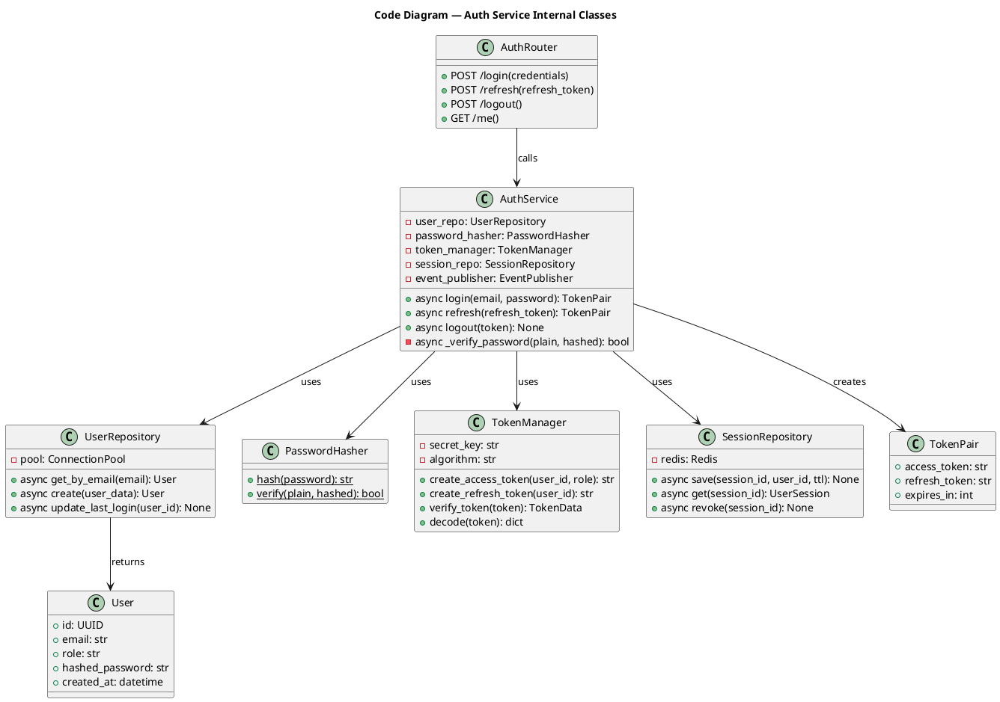
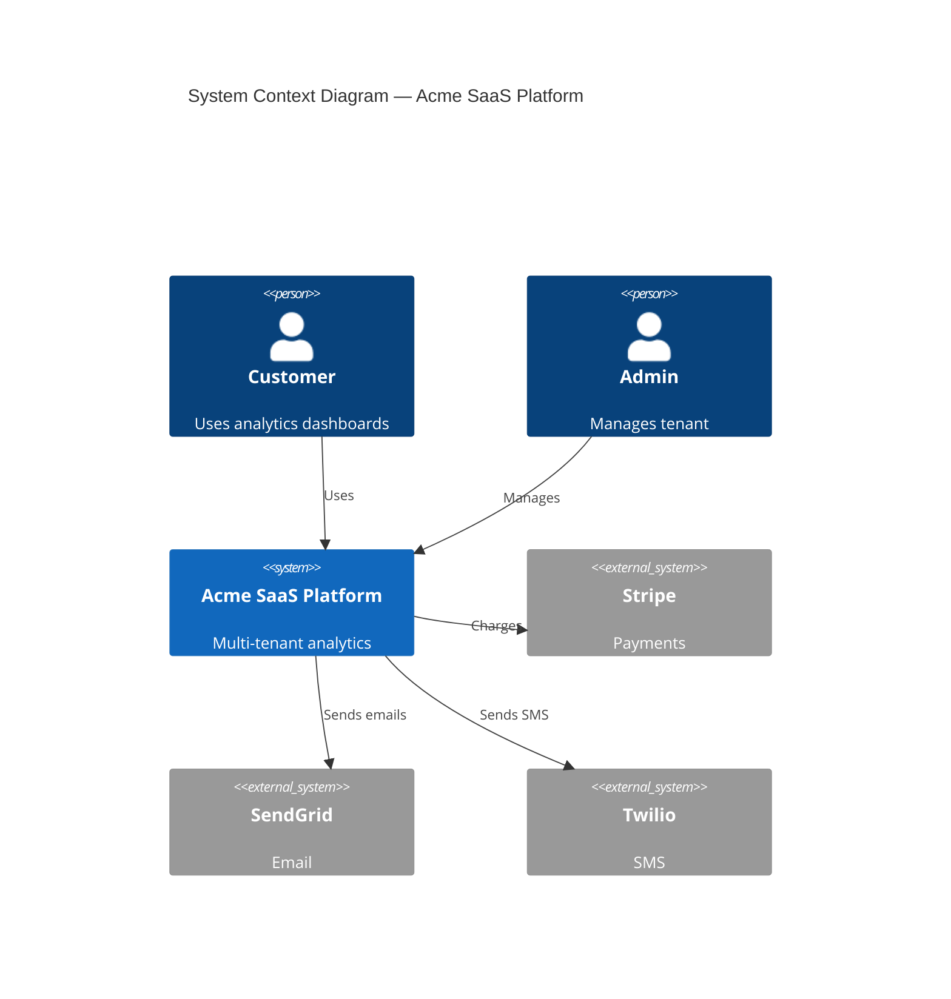
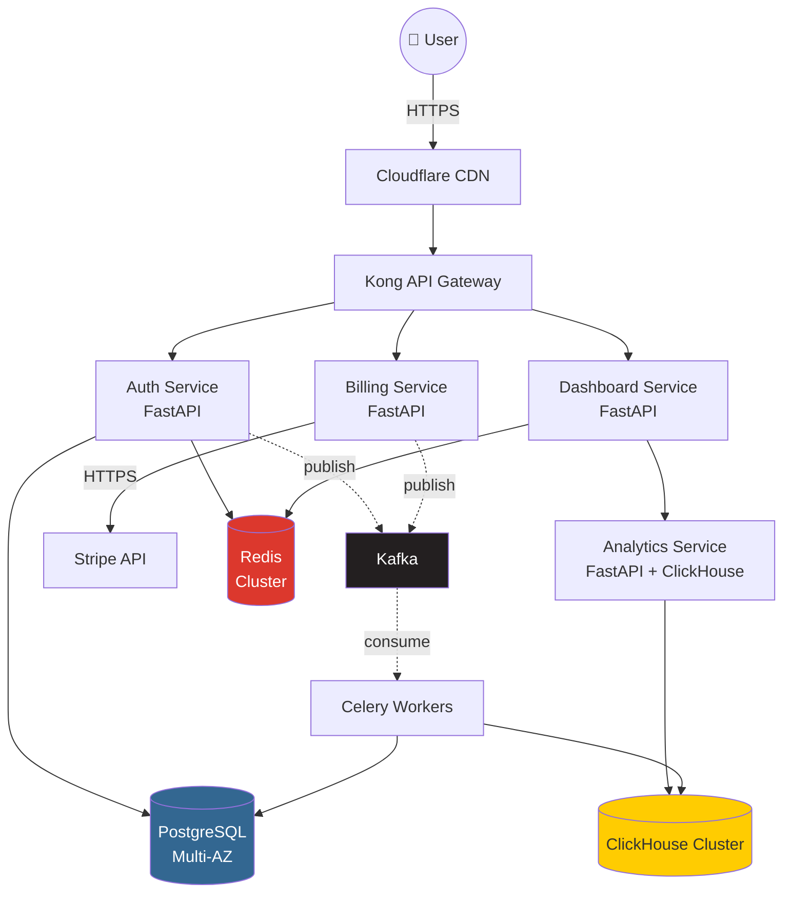
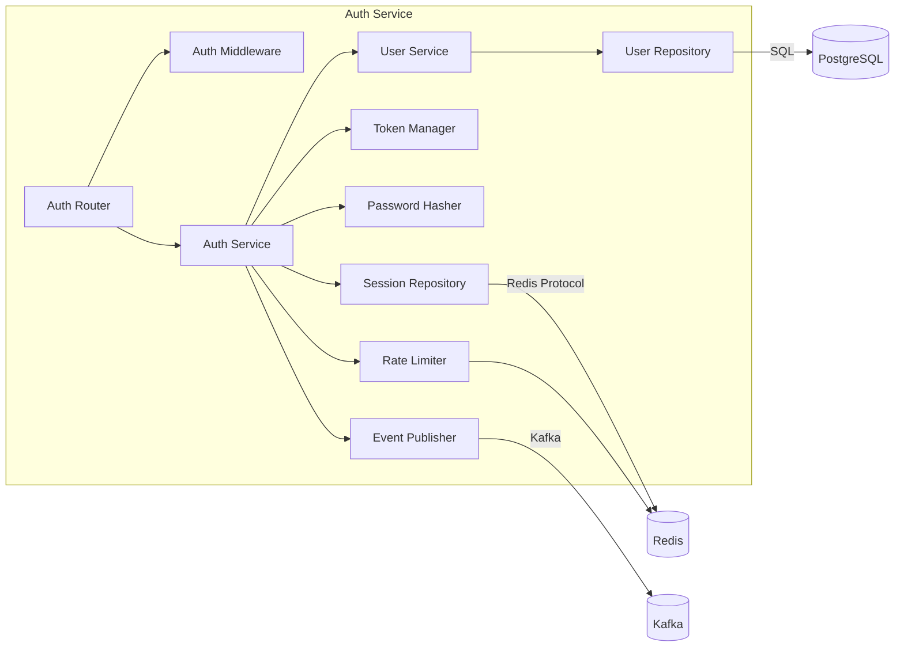
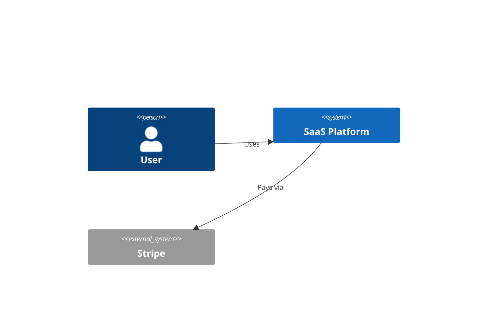
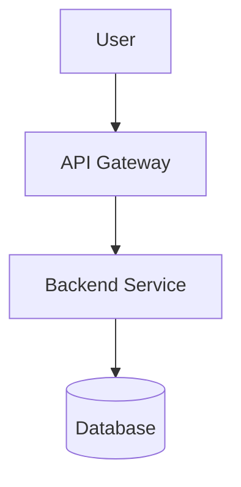

# Lecture 5 — Practical Hands-On: Documentation Code & Templates

> **Theory file:** [05_Documenting_Architecture_ADR_C4.md](05_Documenting_Architecture_ADR_C4.md)

---

## 🎯 Is Practical Mein Kya Karenge?

Working code + templates for:

1. **PlantUML** — All 4 C4 levels (copy-paste ready)
2. **Mermaid** — C4 in markdown (GitHub-native)
3. **Structurizr DSL** — C4 as code (advanced)
4. **5 Production ADRs** (real templates)
5. **arc42 template** (German-popular alternative)
6. **Automated docs in CI/CD**
7. **ADR tools** (CLI for managing ADRs)

---

## 1. PlantUML — All 4 C4 Levels

### Setup

```bash
# Install PlantUML CLI
brew install plantuml
# Or via Docker
docker pull plantuml/plantuml

# Render
plantuml diagram.puml  # creates diagram.png
```

### C4 Level 1 — Context Diagram (PlantUML)

```plantuml
@startuml SaaS-Context

!include https://raw.githubusercontent.com/plantuml-stdlib/C4-PlantUML/master/C4_Context.puml

title System Context Diagram — Acme SaaS Analytics Platform

Person(customer, "Customer", "End user using analytics dashboards")
Person(admin, "Admin User", "Tenant administrator")
Person(superadmin, "Super Admin", "Internal Acme employee")

System(saas, "Acme SaaS Platform", "Multi-tenant analytics platform")

System_Ext(stripe, "Stripe", "Payment processing")
System_Ext(sendgrid, "SendGrid", "Email delivery")
System_Ext(twilio, "Twilio", "SMS notifications")
System_Ext(googleAnalytics, "Google Analytics", "Usage tracking")
System_Ext(slack, "Slack", "Incident notifications")

Rel(customer, saas, "Views dashboards, runs queries", "HTTPS")
Rel(admin, saas, "Manages tenant settings, billing", "HTTPS")
Rel(superadmin, saas, "Monitors system, supports customers", "HTTPS")

Rel(saas, stripe, "Charges subscriptions", "HTTPS/REST")
Rel(saas, sendgrid, "Sends emails", "HTTPS/REST")
Rel(saas, twilio, "Sends SMS alerts", "HTTPS/REST")
Rel(saas, googleAnalytics, "Tracks usage", "HTTPS/REST")
Rel(saas, slack, "Posts alerts", "HTTPS/Webhook")

@enduml
```

### C4 Level 2 — Container Diagram (PlantUML)

```plantuml
@startuml SaaS-Containers

!include https://raw.githubusercontent.com/plantuml-stdlib/C4-PlantUML/master/C4_Container.puml

title Container Diagram — Acme SaaS Platform

Person(user, "User", "Customer using analytics")

System_Boundary(saas, "Acme SaaS Platform") {
    Container(spa, "Web Application", "React + TypeScript", "Provides analytics UI")
    Container(mobile, "Mobile App", "React Native", "Provides mobile access")

    Container(gateway, "API Gateway", "Kong", "Routes, auth, rate limit")

    Container(authSvc, "Auth Service", "FastAPI", "Manages users, JWT tokens")
    Container(tenantSvc, "Tenant Service", "FastAPI", "Multi-tenant management")
    Container(dashboardSvc, "Dashboard Service", "FastAPI", "Renders dashboards")
    Container(analyticsSvc, "Analytics Service", "FastAPI + ClickHouse client", "OLAP queries")
    Container(billingSvc, "Billing Service", "FastAPI", "Stripe integration")

    ContainerDb(postgres, "PostgreSQL", "RDS Multi-AZ", "User, tenant, subscription data")
    ContainerDb(clickhouse, "ClickHouse", "Self-hosted cluster", "Analytical event store")
    ContainerDb(redis, "Redis", "ElastiCache", "Sessions + cache")

    Container(kafka, "Kafka", "Confluent Cloud", "Event streaming")
    Container(workers, "Background Workers", "Celery + Python", "Async processing")
}

System_Ext(stripe, "Stripe", "Payments")

Rel(user, spa, "Uses", "HTTPS")
Rel(user, mobile, "Uses", "HTTPS")
Rel(spa, gateway, "Calls API", "HTTPS")
Rel(mobile, gateway, "Calls API", "HTTPS")

Rel(gateway, authSvc, "Authenticates", "HTTP/gRPC")
Rel(gateway, tenantSvc, "Routes", "HTTP")
Rel(gateway, dashboardSvc, "Routes", "HTTP")
Rel(gateway, billingSvc, "Routes", "HTTP")

Rel(dashboardSvc, analyticsSvc, "Queries", "gRPC")
Rel(analyticsSvc, clickhouse, "Reads/writes", "ClickHouse protocol")

Rel(authSvc, postgres, "Reads/writes", "SQL")
Rel(tenantSvc, postgres, "Reads/writes", "SQL")
Rel(billingSvc, postgres, "Reads/writes", "SQL")

Rel_R(authSvc, redis, "Sessions, cache", "Redis protocol")
Rel_R(dashboardSvc, redis, "Cache", "Redis protocol")

Rel(billingSvc, stripe, "Charges", "HTTPS")

Rel(authSvc, kafka, "Publishes events", "Kafka protocol")
Rel(tenantSvc, kafka, "Publishes events", "Kafka protocol")
Rel(billingSvc, kafka, "Publishes events", "Kafka protocol")

Rel(kafka, workers, "Consumes events", "Kafka protocol")
Rel(workers, postgres, "Writes", "SQL")
Rel(workers, clickhouse, "Writes events", "ClickHouse protocol")

@enduml
```

### C4 Level 3 — Component Diagram (PlantUML)

```plantuml
@startuml AuthService-Components

!include https://raw.githubusercontent.com/plantuml-stdlib/C4-PlantUML/master/C4_Component.puml

title Component Diagram — Auth Service

Container(gateway, "API Gateway", "Kong")
ContainerDb(postgres, "PostgreSQL", "User data")
ContainerDb(redis, "Redis", "Sessions, cache")
Container(kafka, "Kafka", "Event stream")

Container_Boundary(authSvc, "Auth Service (FastAPI)") {
    Component(authRouter, "Auth Router", "FastAPI router", "HTTP endpoints (/login, /refresh, /logout)")
    Component(authMiddleware, "Auth Middleware", "Python middleware", "Validates JWT on protected routes")

    Component(authService, "Auth Service", "Application service", "Login, logout, token refresh logic")
    Component(userService, "User Service", "Application service", "User CRUD")
    Component(passwordHasher, "Password Hasher", "bcrypt", "Hash + verify passwords")
    Component(tokenManager, "Token Manager", "PyJWT", "Generate + validate JWTs")
    Component(rateLimiter, "Rate Limiter", "Redis-based", "Prevent brute force")

    Component(userRepo, "User Repository", "asyncpg", "User data access")
    Component(sessionRepo, "Session Repository", "Redis client", "Active sessions")

    Component(eventPublisher, "Event Publisher", "aiokafka producer", "Publish auth events")
}

Rel(gateway, authRouter, "Routes", "HTTP")
Rel(authRouter, authMiddleware, "Protected by", "")
Rel(authRouter, authService, "Calls", "")
Rel(authService, userService, "Uses", "")
Rel(authService, passwordHasher, "Uses", "")
Rel(authService, tokenManager, "Uses", "")
Rel(authService, rateLimiter, "Checks", "")
Rel(authService, eventPublisher, "Publishes login events", "")

Rel(userService, userRepo, "Uses", "")
Rel(authService, sessionRepo, "Uses", "")

Rel(userRepo, postgres, "Queries", "SQL")
Rel(sessionRepo, redis, "Reads/writes", "Redis")
Rel(rateLimiter, redis, "Counter", "Redis")
Rel(eventPublisher, kafka, "Publishes", "Kafka")

@enduml
```

### C4 Level 4 — Code Diagram (PlantUML)



### Generate from CI

```yaml
# .github/workflows/diagrams.yml
name: Generate Architecture Diagrams

on:
  push:
    paths:
      - 'docs/diagrams/**.puml'

jobs:
  render:
    runs-on: ubuntu-latest
    steps:
      - uses: actions/checkout@v4

      - name: Render PlantUML
        uses: cloudbees/plantuml-github-action@master
        with:
          args: -tpng -o ./output ./docs/diagrams/*.puml

      - name: Commit rendered diagrams
        run: |
          git config user.name "ci-bot"
          git config user.email "ci@acme.com"
          git add docs/diagrams/output/*.png
          git commit -m "Update rendered diagrams [skip ci]" || echo "No changes"
          git push
```

---

## 2. Mermaid — C4 in Markdown (GitHub Native)

### Level 1 — Context (Mermaid)

```markdown


### Level 2 — Container (Mermaid)



### Level 3 — Component (Mermaid)



### Embedded in README.md

```markdown
# Acme SaaS Platform

## Architecture

### System Context



### Container View



(GitHub renders these natively in README — no extra setup!)
```

---

## 3. Structurizr DSL — C4 as Code

### Setup

```bash
# Install Structurizr Lite (free)
docker pull structurizr/lite

# Run
docker run -it --rm -p 8080:8080 \
    -v $PWD/workspace:/usr/local/structurizr \
    structurizr/lite
```

### Complete Workspace File

```
# workspace.dsl
workspace "Acme SaaS Platform" "Multi-tenant analytics platform" {

    !identifiers hierarchical

    model {
        # ─── People ───
        customer = person "Customer" "End user using analytics dashboards"
        admin = person "Admin" "Tenant administrator"
        superadmin = person "Super Admin" "Internal Acme employee"

        # ─── Software System ───
        saas = softwareSystem "Acme SaaS Platform" "Multi-tenant analytics platform" {

            # ─── Containers ───
            spa = container "Web Application" "Provides analytics UI" "React + TypeScript"
            mobile = container "Mobile App" "Mobile access" "React Native"

            gateway = container "API Gateway" "Routes, auth, rate limit" "Kong"

            authSvc = container "Auth Service" "Manages users, JWT" "Python/FastAPI" {
                # ─── Components within Auth Service ───
                authRouter = component "Auth Router" "HTTP endpoints" "FastAPI router"
                authService = component "Auth Service" "Login logic" "Python class"
                userRepo = component "User Repository" "Data access" "asyncpg"
                tokenManager = component "Token Manager" "JWT handling" "PyJWT"
                passwordHasher = component "Password Hasher" "bcrypt" "Python"
                sessionRepo = component "Session Repository" "Redis client" "redis.asyncio"
                eventPublisher = component "Event Publisher" "Kafka producer" "aiokafka"
            }

            tenantSvc = container "Tenant Service" "Multi-tenant mgmt" "Python/FastAPI"
            dashboardSvc = container "Dashboard Service" "Renders dashboards" "Python/FastAPI"
            analyticsSvc = container "Analytics Service" "OLAP queries" "Python + ClickHouse"
            billingSvc = container "Billing Service" "Stripe integration" "Python/FastAPI"

            postgres = container "PostgreSQL" "User, tenant, billing data" "RDS Multi-AZ" "Database"
            clickhouse = container "ClickHouse" "Analytical events" "Self-hosted cluster" "Database"
            redis = container "Redis" "Sessions + cache" "ElastiCache" "Cache"
            kafka = container "Kafka" "Event streaming" "Confluent Cloud" "Queue"
            workers = container "Background Workers" "Async processing" "Celery + Python"
        }

        # ─── External Systems ───
        stripe = softwareSystem "Stripe" "Payment processing" "External"
        sendgrid = softwareSystem "SendGrid" "Email delivery" "External"
        twilio = softwareSystem "Twilio" "SMS notifications" "External"
        slack = softwareSystem "Slack" "Incident notifications" "External"

        # ─── Relationships ───

        # User → System
        customer -> saas.spa "Uses dashboards"
        customer -> saas.mobile "Uses mobile"
        admin -> saas.spa "Manages tenant"
        superadmin -> saas.spa "Monitors system"

        # Web → API Gateway
        saas.spa -> saas.gateway "API calls" "HTTPS/JSON"
        saas.mobile -> saas.gateway "API calls" "HTTPS/JSON"

        # Gateway → Services
        saas.gateway -> saas.authSvc "Auth requests"
        saas.gateway -> saas.tenantSvc "Tenant requests"
        saas.gateway -> saas.dashboardSvc "Dashboard requests"
        saas.gateway -> saas.billingSvc "Billing requests"

        # Service → Service
        saas.dashboardSvc -> saas.analyticsSvc "Queries" "gRPC"

        # Services → DBs
        saas.authSvc -> saas.postgres "Reads/writes" "SQL"
        saas.tenantSvc -> saas.postgres "Reads/writes" "SQL"
        saas.billingSvc -> saas.postgres "Reads/writes" "SQL"
        saas.analyticsSvc -> saas.clickhouse "Reads/writes" "ClickHouse"
        saas.workers -> saas.postgres "Writes"
        saas.workers -> saas.clickhouse "Writes"

        # Services → Cache
        saas.authSvc -> saas.redis "Sessions, cache"
        saas.dashboardSvc -> saas.redis "Cache"

        # Services → Kafka
        saas.authSvc -> saas.kafka "Publishes events"
        saas.tenantSvc -> saas.kafka "Publishes events"
        saas.billingSvc -> saas.kafka "Publishes events"
        saas.kafka -> saas.workers "Consumes"

        # External integrations
        saas.billingSvc -> stripe "Charges" "HTTPS"
        saas.workers -> sendgrid "Sends emails" "HTTPS"
        saas.workers -> twilio "Sends SMS" "HTTPS"
        saas.workers -> slack "Posts alerts" "HTTPS"

        # ─── Component-level relationships (inside Auth Service) ───
        saas.gateway -> saas.authSvc.authRouter "HTTP requests"
        saas.authSvc.authRouter -> saas.authSvc.authService "Calls"
        saas.authSvc.authService -> saas.authSvc.userRepo "User CRUD"
        saas.authSvc.authService -> saas.authSvc.tokenManager "Token operations"
        saas.authSvc.authService -> saas.authSvc.passwordHasher "Password ops"
        saas.authSvc.authService -> saas.authSvc.sessionRepo "Session mgmt"
        saas.authSvc.authService -> saas.authSvc.eventPublisher "Publishes auth events"
        saas.authSvc.userRepo -> saas.postgres "Queries"
        saas.authSvc.sessionRepo -> saas.redis "Reads/writes"
        saas.authSvc.eventPublisher -> saas.kafka "Publishes"
    }

    views {
        # ─── View 1: System Context (Level 1) ───
        systemContext saas "SystemContext" {
            include *
            autoLayout
            title "System Context Diagram"
        }

        # ─── View 2: Container View (Level 2) ───
        container saas "Containers" {
            include *
            autoLayout
            title "Container Diagram"
        }

        # ─── View 3: Component View — Auth Service (Level 3) ───
        component saas.authSvc "AuthServiceComponents" {
            include *
            autoLayout
            title "Component Diagram — Auth Service"
        }

        # ─── Styles ───
        styles {
            element "Person" {
                background #08427B
                color #ffffff
                fontSize 22
                shape Person
            }
            element "Software System" {
                background #1168BD
                color #ffffff
            }
            element "External" {
                background #999999
                color #ffffff
            }
            element "Container" {
                background #438DD5
                color #ffffff
            }
            element "Database" {
                shape Cylinder
                background #438DD5
            }
            element "Cache" {
                shape Cylinder
                background #C13E3E
            }
            element "Queue" {
                shape Pipe
                background #4E342E
            }
            element "Component" {
                background #85BBF0
                color #000000
            }
        }
    }
}
```

### Render It

```bash
# Save above as workspace.dsl in current dir
docker run -it --rm -p 8080:8080 \
    -v $PWD:/usr/local/structurizr \
    structurizr/lite

# Open http://localhost:8080 — interactive C4 explorer!
```

---

## 4. 5 Production ADR Templates

### ADR Template (Markdown)

Save as `docs/adr/template.md`:

```markdown
# ADR-NNN: [Title — present tense, decision-focused]

## Status

[Proposed | Accepted | Deprecated | Superseded by ADR-XXX]

## Date

YYYY-MM-DD

## Participants

- Name 1 (role)
- Name 2 (role)

## Context

Describe the situation that requires a decision. Include:
- The problem/opportunity
- Constraints (technical, business, time)
- Forces at play
- Why decision needed NOW

## Decision

The decision in 1-3 sentences. Clear, unambiguous.

Followed by detail:
- Specific technology choices
- Configuration parameters
- Scope (where this applies, where it doesn't)

## Alternatives Considered

### Option A: [Name]
- Description
- Pros: ...
- Cons: ...
- Why rejected (or chosen)

### Option B: [Name]
[Same structure]

### Option C: [Name]
[Same structure]

## Consequences

### Positive
- + Benefit 1
- + Benefit 2

### Negative
- - Drawback 1
- - Drawback 2

### Risks & Mitigations
- **Risk**: Description
  - **Mitigation**: How we'll handle it

## Related ADRs

- ADR-XXX: [related decision]

## References

- Documentation links
- Blog posts that informed this
- RFCs / Papers

## Review Date

YYYY-MM-DD (revisit this decision)
```

### ADR Example 1: Database Choice

`docs/adr/ADR-002-postgresql-primary-db.md`

```markdown
# ADR-002: Use PostgreSQL as Primary Database

## Status
Accepted

## Date
2026-05-15

## Participants
- Ashish Kumar (Architect)
- Priya Patel (Senior Engineer)
- Rajesh Singh (DBA Consultant)

## Context

We're starting a new SaaS analytics platform. Need to choose primary database for:
- User accounts (~100K)
- Tenant management
- Subscriptions (billing critical)
- Audit logs (compliance)
- ~50M transactional records/year

Constraints:
- ACID needed for billing
- Team has 5+ years PostgreSQL experience
- Compliance: India DPDP + EU GDPR

## Decision

Use **PostgreSQL 16** (AWS RDS Multi-AZ) as primary database.

Specifics:
- Engine: PostgreSQL 16
- Instance: db.r6g.xlarge (4 vCPU, 32 GB RAM)
- Storage: 500 GB GP3 SSD, encrypted at rest
- Multi-AZ for failover
- Read replicas (2) for analytics queries
- Connection pooling via PgBouncer
- Daily backups + PITR (point-in-time recovery)
- Region: ap-south-1 (India users), eu-west-1 (EU users)

## Alternatives Considered

### Option A: MongoDB
- ✓ Document model flexibility
- ✓ JSON-native (matches our JSON-heavy events)
- ✗ Weaker ACID guarantees
- ✗ Team lacks expertise
- ✗ Multi-document transactions complex
- **Rejected** — ACID critical for billing

### Option B: DynamoDB
- ✓ Massive scale, fully managed
- ✓ No database admin overhead
- ✗ AWS vendor lock-in
- ✗ Limited query patterns (no JOINs)
- ✗ Costly at our access patterns
- **Rejected** — too restrictive

### Option C: CockroachDB
- ✓ PostgreSQL-compatible
- ✓ Distributed by default
- ✗ Higher operational cost
- ✗ Latency higher than RDS PostgreSQL
- ✗ Smaller ecosystem
- **Rejected** — overkill for current scale

## Consequences

### Positive
- ✓ ACID for billing-critical data
- ✓ Rich query language (JOINs, CTEs, window functions)
- ✓ Mature ecosystem (SQLAlchemy, Alembic, asyncpg)
- ✓ Team can be productive Day 1
- ✓ pgvector for future AI/ML use
- ✓ Easy local development (one Docker image)

### Negative
- - Vertical scaling has limits (~50TB for single instance)
- - Need sharding strategy if scale exceeds 10x in 2 years
- - Failover takes 60-120 seconds (Multi-AZ)

### Risks & Mitigations
- **Risk**: Scale beyond single instance
  - **Mitigation**: Plan for Citus/pg_partman in Year 2

- **Risk**: Long-running migrations affect availability
  - **Mitigation**: Use pg-ost, plan migrations during low traffic

- **Risk**: Cross-region writes have latency
  - **Mitigation**: Use read replicas in remote regions for reads only

## Related ADRs
- ADR-001: Microservices architecture
- ADR-007: Multi-region deployment strategy

## References
- [PostgreSQL Documentation](https://postgresql.org/docs)
- [AWS RDS PostgreSQL Best Practices](https://docs.aws.amazon.com/AmazonRDS/latest/UserGuide/CHAP_BestPractices.PostgreSQL.html)

## Review Date
2026-11-15 (6 months) — assess if scale requires sharding
```

### ADR Example 2: Container Orchestration

`docs/adr/ADR-005-kubernetes-orchestration.md`

```markdown
# ADR-005: Adopt Kubernetes for Container Orchestration

## Status
Accepted

## Date
2026-05-25

## Participants
- Ashish Kumar (Architect)
- Suresh Reddy (DevOps Lead)

## Context

We have ~10 microservices currently. Plan to grow to 20-30 in next year.

Currently deployed on individual EC2 instances with Ansible. Pain points:
- Manual scaling
- No standardized health checks
- Difficult rolling updates
- Inconsistent across services

Need:
- Orchestration platform
- Self-healing services
- Auto-scaling
- Standardized deployment

## Decision

Use **Amazon EKS (Kubernetes 1.29)** as orchestration platform.

Configuration:
- Managed control plane
- Worker nodes: m5.xlarge (auto-scaling 5-50)
- Multi-AZ deployment
- Helm for application packaging
- ArgoCD for GitOps deployment
- Istio for service mesh (Phase 2)

## Alternatives Considered

### Option A: AWS ECS
- ✓ Simpler than K8s
- ✓ AWS-native
- ✗ AWS lock-in
- ✗ Smaller ecosystem
- ✗ Limited multi-region story
- **Rejected** — long-term lock-in concern

### Option B: Docker Swarm
- ✓ Simple
- ✗ Declining adoption
- ✗ Limited features
- **Rejected** — dying ecosystem

### Option C: Stay on EC2 + Ansible
- ✓ No migration needed
- ✗ Doesn't solve current pain points
- **Rejected** — status quo not acceptable

## Consequences

### Positive
- ✓ Self-healing services
- ✓ Auto-scaling (HPA, VPA, Cluster Autoscaler)
- ✓ Standardized deployment via Helm
- ✓ Better resource utilization
- ✓ Industry-standard skills (easier hiring)
- ✓ Multi-cloud portability (if needed)

### Negative
- - 3-month migration project
- - Steep learning curve
- - More operational complexity
- - Higher initial cost (EKS control plane $73/month)

### Risks & Mitigations
- **Risk**: Team unfamiliarity with K8s
  - **Mitigation**: K8s training for whole team; hire experienced SRE

- **Risk**: Long migration disrupts product velocity
  - **Mitigation**: Migrate service-by-service over 3 months

- **Risk**: Costs higher than expected
  - **Mitigation**: Use Spot instances for non-critical workloads

## Migration Plan
- Month 1: Setup EKS, migrate dev/staging
- Month 2: Migrate non-critical production services
- Month 3: Migrate critical production services
- Month 4: Decommission EC2 instances

## Review Date
2026-09-25 (4 months) — assess migration progress
```

### ADR Example 3: Messaging Choice

`docs/adr/ADR-008-kafka-for-events.md`

```markdown
# ADR-008: Use Apache Kafka for Event Streaming

## Status
Accepted

## Date
2026-05-30

## Participants
- Ashish Kumar (Architect)
- Sruthi Iyer (Senior Engineer)

## Context

Need event-driven communication between microservices for:
- Order lifecycle events (created, shipped, etc.)
- Notification fan-out (1 event → email + SMS + push)
- Audit log streaming
- Analytics ingestion (~1B events/day projected)

## Decision

Use **Confluent Cloud Kafka** as primary event streaming platform.

Specifics:
- Confluent Cloud (managed service)
- Standard tier initially (Dedicated when traffic > 100MB/s)
- Schema Registry for Avro events
- 3 brokers minimum (HA)
- Retention: 7 days for most topics, 30 days for audit

## Alternatives Considered

### Option A: RabbitMQ
- ✓ Easier to operate
- ✓ Good for task queues
- ✗ Lower throughput at scale
- ✗ Doesn't support event replay
- **Rejected** — won't scale to 1B events/day

### Option B: AWS SQS + SNS
- ✓ Managed by AWS
- ✓ Simple
- ✗ No event replay
- ✗ Limited ordering
- ✗ AWS lock-in
- **Rejected**

### Option C: Self-hosted Apache Kafka
- ✓ No vendor cost
- ✗ Operational burden
- ✗ Need Kafka expertise
- **Rejected** — Confluent Cloud worth the cost

## Consequences

### Positive
- ✓ Massive throughput (millions/sec)
- ✓ Event replay for debugging
- ✓ Strong ordering per partition
- ✓ Mature ecosystem (Kafka Connect, ksqlDB)
- ✓ Schema evolution via Schema Registry

### Negative
- - Operational complexity (mitigated by Confluent Cloud)
- - Higher cost (~$500-2000/month vs SQS $50/month)
- - Learning curve for team
- - More complex consumer code (offsets, partitions)

### Risks
- **Risk**: Cost spike with growing traffic
  - **Mitigation**: Tier-up to Dedicated when crossing thresholds; consider self-hosting at $10K+/month

- **Risk**: Vendor (Confluent) lock-in
  - **Mitigation**: Kafka API is open standard — can migrate to self-hosted

## Review Date
2026-11-30
```

### ADR Example 4: Authentication

`docs/adr/ADR-003-jwt-authentication.md`

(Already shown in lecture 4 practical — see there)

### ADR Example 5: Multi-Region Strategy

`docs/adr/ADR-007-multi-region-deployment.md`

(Already shown in lecture 4 practical — see there)

---

## 5. arc42 Template (Alternative)

arc42 is a popular German-origin architecture documentation template. **More comprehensive than C4 alone.**

### Folder Structure

```
docs/architecture/
├── arc42/
│   ├── 01_introduction_goals.md
│   ├── 02_constraints.md
│   ├── 03_context_scope.md
│   ├── 04_solution_strategy.md
│   ├── 05_building_block_view.md
│   ├── 06_runtime_view.md
│   ├── 07_deployment_view.md
│   ├── 08_concepts.md
│   ├── 09_decisions.md           # → links to ADRs
│   ├── 10_quality_requirements.md
│   ├── 11_risks_technical_debt.md
│   └── 12_glossary.md
├── adr/
│   └── ADR-XXX-*.md
└── diagrams/
    ├── context.puml
    ├── containers.puml
    └── components/
```

### Sample: `01_introduction_goals.md`

```markdown
# 1. Introduction and Goals

## 1.1 Requirements Overview

Acme SaaS is a multi-tenant analytics platform for B2B customers.

**Top-level goals:**
- Provide real-time analytics dashboards
- Support 1000+ tenants on shared infrastructure
- Scale to 100K concurrent users
- Maintain 99.95% availability
- Comply with GDPR + India DPDP

## 1.2 Quality Goals

| Priority | Quality | Description |
|----------|---------|-------------|
| 1 | Reliability | 99.95% uptime, MTTR < 10 min |
| 2 | Performance | p95 latency < 500ms for dashboards |
| 3 | Scalability | Support 10x growth without redesign |
| 4 | Security | OWASP Top 10, encryption everywhere |
| 5 | Maintainability | New devs productive in < 1 week |

## 1.3 Stakeholders

| Role | Concerns |
|------|----------|
| End user | Fast dashboards, no downtime |
| Tenant admin | Easy onboarding, billing clarity |
| Engineering | Easy to develop + debug |
| SRE | Easy to operate + monitor |
| Compliance | Audit trails, data residency |
| CEO | Cost efficiency, growth potential |
```

### Sample: `10_quality_requirements.md`

```markdown
# 10. Quality Requirements

## Quality Scenarios

### Performance Scenarios

**Q1: Dashboard load under load**
- Source: 100K concurrent users
- Stimulus: Request dashboard
- Response: p95 < 500ms, p99 < 2s
- Measure: Prometheus + Grafana

**Q2: Real-time analytics**
- Source: Data ingestion pipeline
- Stimulus: Event published to Kafka
- Response: Available in dashboard within 60 seconds
- Measure: End-to-end latency tracking

### Availability Scenarios

**Q3: Service failure**
- Source: One service crashes
- Stimulus: Health check fails
- Response: K8s restarts within 30s; circuit breaker prevents cascading
- Measure: Uptime monitoring

**Q4: Region outage**
- Source: AWS ap-south-1 outage
- Stimulus: Region unavailable
- Response: Failover to us-east-1 within 10 minutes
- Measure: DR drill quarterly

### Security Scenarios

**Q5: Brute force attack**
- Source: Attacker tries 1000 passwords
- Stimulus: Multiple failed login attempts
- Response: Account locked after 5 failures; rate limit IP after 20 failures
- Measure: Audit logs

## Quality Tree

```
Acme SaaS Quality
├── Performance
│   ├── Q1: Dashboard load
│   └── Q2: Real-time
├── Availability
│   ├── Q3: Service failure
│   └── Q4: Region outage
└── Security
    └── Q5: Brute force
```
```

---

## 6. ADR Management Tools

### Install adr-tools

```bash
# macOS
brew install adr-tools

# Or download from GitHub
git clone https://github.com/npryce/adr-tools.git
echo 'export PATH=$PATH:~/adr-tools/src' >> ~/.zshrc
```

### Usage

```bash
# Initialize ADR directory
adr init docs/adr

# Create new ADR
adr new "Use PostgreSQL as primary database"
# Creates: docs/adr/0001-use-postgresql-as-primary-database.md

# Supersede an ADR
adr new -s 5 "Use CockroachDB instead of PostgreSQL"
# Creates: docs/adr/0010-use-cockroachdb-instead-of-postgresql.md
# Marks ADR-5 as superseded

# List all ADRs
adr list

# Generate index
adr generate toc > docs/adr/README.md
```

### log4brains — Web UI for ADRs

```bash
npm install -g log4brains

cd your-project
log4brains init

# Add ADRs as before
log4brains adr new "Use FastAPI"

# Run web UI
log4brains preview
# Opens beautiful searchable UI for all ADRs at http://localhost:4004
```

### CI Integration

```yaml
# .github/workflows/adr-check.yml
name: ADR Compliance

on:
  pull_request:

jobs:
  adr-check:
    runs-on: ubuntu-latest
    steps:
      - uses: actions/checkout@v4

      - name: Check if architectural change has ADR
        run: |
          # Check if PR touches certain paths
          CHANGED=$(git diff --name-only origin/main HEAD)
          ARCH_CHANGES=$(echo "$CHANGED" | grep -E "(infra/|migrations/|docker-compose|Dockerfile)" | wc -l)
          ADR_CHANGES=$(echo "$CHANGED" | grep -E "docs/adr/" | wc -l)

          if [ "$ARCH_CHANGES" -gt 0 ] && [ "$ADR_CHANGES" -eq 0 ]; then
            echo "❌ Architectural changes detected but no new ADR. Consider documenting in docs/adr/"
            exit 1
          fi

      - name: Validate ADR format
        run: |
          for adr in docs/adr/*.md; do
            grep -E "^# ADR-[0-9]+" "$adr" || (echo "Invalid title in $adr" && exit 1)
            grep -E "^## Status" "$adr" || (echo "Missing Status in $adr" && exit 1)
            grep -E "^## Context" "$adr" || (echo "Missing Context in $adr" && exit 1)
            grep -E "^## Decision" "$adr" || (echo "Missing Decision in $adr" && exit 1)
          done
```

---

## 7. Automated Docs in CI/CD

### Auto-Generate Diagrams on Push

```yaml
# .github/workflows/docs.yml
name: Build Architecture Docs

on:
  push:
    branches: [main]
    paths:
      - 'docs/**'
      - 'workspace.dsl'

jobs:
  build-docs:
    runs-on: ubuntu-latest
    steps:
      - uses: actions/checkout@v4

      # Generate Structurizr exports
      - name: Render Structurizr DSL
        run: |
          docker run --rm \
            -v $PWD:/usr/local/structurizr \
            structurizr/cli export \
            -workspace workspace.dsl \
            -format mermaid \
            -output docs/diagrams/generated

      # Render PlantUML
      - name: Render PlantUML
        uses: cloudbees/plantuml-github-action@master
        with:
          args: -tsvg -o docs/diagrams/rendered docs/diagrams/*.puml

      # Build MkDocs site
      - name: Build MkDocs
        run: |
          pip install mkdocs mkdocs-material mkdocs-mermaid2-plugin
          mkdocs build

      # Deploy to GitHub Pages
      - name: Deploy
        uses: peaceiris/actions-gh-pages@v3
        with:
          github_token: ${{ secrets.GITHUB_TOKEN }}
          publish_dir: ./site
```

### MkDocs Config

```yaml
# mkdocs.yml
site_name: Acme SaaS Architecture
site_url: https://acme.github.io/architecture
repo_url: https://github.com/acme/saas-platform

theme:
  name: material
  features:
    - navigation.tabs
    - navigation.sections
    - toc.integrate
    - search.suggest

plugins:
  - search
  - mermaid2

nav:
  - Home: index.md
  - Architecture:
    - Overview: architecture/overview.md
    - Context (Level 1): architecture/level-1-context.md
    - Containers (Level 2): architecture/level-2-containers.md
    - Components (Level 3): architecture/level-3-components.md
  - Decisions:
    - Index: adr/index.md
    - ADR-001 Microservices: adr/ADR-001.md
    - ADR-002 PostgreSQL: adr/ADR-002.md
    - ADR-003 JWT Auth: adr/ADR-003.md
  - Standards:
    - Coding: standards/coding.md
    - API Design: standards/api.md
    - Security: standards/security.md
  - Operations:
    - Runbooks: ops/runbooks.md
    - Monitoring: ops/monitoring.md
```

### Auto-Generated API Docs

```python
# src/main.py
from fastapi import FastAPI

app = FastAPI(
    title="Acme SaaS API",
    description="Multi-tenant analytics platform",
    version="1.0.0",
    openapi_url="/openapi.json",
    docs_url="/docs",      # Swagger UI
    redoc_url="/redoc",     # ReDoc
    openapi_tags=[
        {"name": "auth", "description": "Authentication"},
        {"name": "dashboards", "description": "Dashboard operations"},
        {"name": "billing", "description": "Billing & subscriptions"},
    ],
)


@app.get("/health/live")
async def liveness():
    """Health check endpoint for K8s liveness probe."""
    return {"status": "alive"}


# Export OpenAPI spec for inclusion in docs
import json

@app.on_event("startup")
async def export_openapi():
    with open("docs/api/openapi.json", "w") as f:
        json.dump(app.openapi(), f, indent=2)
```

---

## 8. Living Architecture Documentation Setup

### Final Folder Structure

```
your-project/
├── README.md                       # Entry point — links to all docs
├── docs/
│   ├── architecture/
│   │   ├── overview.md            # Architecture summary
│   │   ├── level-1-context.md     # C4 Level 1 narrative
│   │   ├── level-2-containers.md  # C4 Level 2 narrative
│   │   ├── level-3-components.md  # C4 Level 3 narrative
│   │   └── diagrams/
│   │       ├── *.puml             # PlantUML source
│   │       └── rendered/          # Generated PNGs (gitignored)
│   ├── adr/
│   │   ├── README.md              # Auto-generated index
│   │   ├── template.md            # Template for new ADRs
│   │   ├── 0001-microservices.md
│   │   ├── 0002-postgresql.md
│   │   └── ...
│   ├── api/
│   │   └── openapi.json           # Generated from FastAPI
│   ├── runbooks/
│   │   ├── on-call-handbook.md
│   │   └── service-X-runbook.md
│   ├── standards/
│   │   ├── coding-standards.md
│   │   ├── api-design.md
│   │   └── security.md
│   └── arc42/
│       ├── 01_introduction_goals.md
│       └── ...
├── workspace.dsl                   # Structurizr DSL
├── mkdocs.yml                      # MkDocs config
└── .github/
    └── workflows/
        ├── docs.yml                # Auto-build docs
        ├── adr-check.yml           # Verify ADRs
        └── diagrams.yml            # Render diagrams
```

### README.md Template

```markdown
# Acme SaaS Platform

Multi-tenant analytics platform for B2B customers.

## 🚀 Quick Start

```bash
git clone ...
docker-compose up
open http://localhost:8000/docs   # API docs
```

## 📚 Documentation

- **[Architecture Overview](docs/architecture/overview.md)** — Start here
- **[System Context (C4 L1)](docs/architecture/level-1-context.md)** — How we fit in the world
- **[Containers (C4 L2)](docs/architecture/level-2-containers.md)** — Major building blocks
- **[Components (C4 L3)](docs/architecture/level-3-components.md)** — Inside each service
- **[Architecture Decisions](docs/adr/README.md)** — Why we made specific choices
- **[Runbooks](docs/runbooks/on-call-handbook.md)** — Operational guides

## 🔧 Development

- **[Coding Standards](docs/standards/coding-standards.md)**
- **[API Design](docs/standards/api-design.md)**
- **[Security Guidelines](docs/standards/security.md)**

## 🏗 Stack

- **Backend**: Python 3.12, FastAPI, asyncio
- **Database**: PostgreSQL 16, Redis 7
- **Messaging**: Kafka (Confluent Cloud)
- **Deployment**: Kubernetes (EKS), ArgoCD
- **Observability**: OpenTelemetry, Grafana, Loki, Tempo

## 📊 Recent ADRs

- [ADR-008: Adopt Kafka for Events](docs/adr/0008-kafka.md) (2026-05-30)
- [ADR-007: Multi-Region Deployment](docs/adr/0007-multi-region.md) (2026-05-26)
- [ADR-005: Kubernetes Orchestration](docs/adr/0005-kubernetes.md) (2026-05-25)

## 🤝 Contributing

See [CONTRIBUTING.md](CONTRIBUTING.md) for our development process.

For architectural changes, please:
1. Create an ADR in `docs/adr/`
2. Update relevant C4 diagrams
3. Get review from architecture team
```

---

## 9. Summary

### Tools Stack

```
DIAGRAMS:
- Mermaid       → markdown-friendly, GitHub-native
- PlantUML      → more detailed, scriptable
- Structurizr   → C4-specific, code-driven

DECISIONS:
- ADRs          → lightweight, version-controlled
- adr-tools     → CLI for managing ADRs
- log4brains    → web UI for ADRs

COMPREHENSIVE:
- arc42         → full architecture template
- MkDocs        → static site for docs
- GitHub Pages  → free hosting

AUTOMATION:
- GitHub Actions → render diagrams, validate ADRs
- OpenAPI export → auto-generated API docs
- PlantUML CLI   → CI-renderable diagrams
```

### Action Items

1. ✅ **Initialize ADR folder** in your current project
2. ✅ **Write 3 ADRs** for past architectural decisions
3. ✅ **Add Mermaid C4 Level 1** to your README.md
4. ✅ **Set up MkDocs** for your architecture docs
5. ✅ **Add CI workflow** to auto-render diagrams

---

## 10. Cheat Sheet

```
For quick diagrams:           Mermaid (in README.md)
For team docs:                MkDocs + Material theme
For C4 with details:          Structurizr DSL
For comprehensive docs:       arc42 template
For decision history:         ADRs in docs/adr/
For ops runbooks:             Separate folder, linked from README
For API docs:                 FastAPI auto-generated /docs
```

---

## 11. Related Resources

- **C4 Model**: https://c4model.com
- **Structurizr**: https://structurizr.com
- **PlantUML C4**: https://github.com/plantuml-stdlib/C4-PlantUML
- **arc42**: https://arc42.org
- **MkDocs Material**: https://squidfunk.github.io/mkdocs-material/
- **adr-tools**: https://github.com/npryce/adr-tools
- **log4brains**: https://github.com/thomvaill/log4brains
- **OpenAPI**: https://swagger.io/specification/
- **AsyncAPI** (for events): https://www.asyncapi.com
