# DSA Approaches — Architecture & Flowcharts

> **Rule:** Pehle approach decide karo, phir code likhо.
> Yahan sirf mental model hai — koi code nahi.

---

## Master Decision Tree — Kaunsa Approach Use Karo?

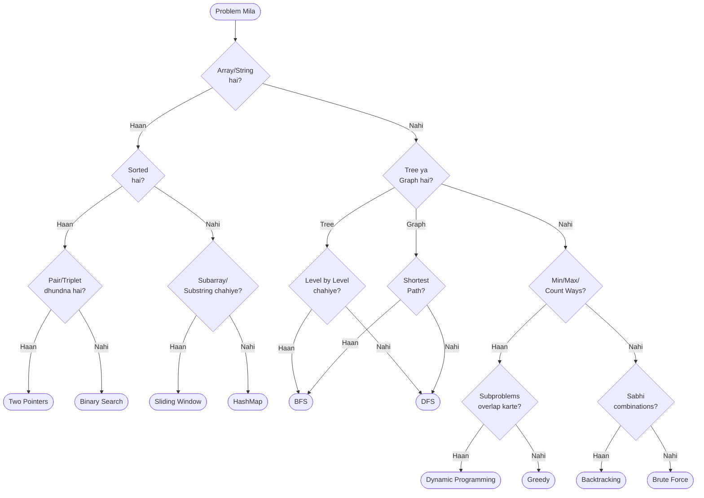
```mermaid
flowchart TD
    START([Problem Mila]) --> Q1{Array/String\nhai?}

    Q1 -->|Haan| Q2{Sorted\nhai?}
    Q1 -->|Nahi| Q3{Tree ya\nGraph hai?}

    Q2 -->|Haan| Q4{Pair/Triplet\ndhundna hai?}
    Q2 -->|Nahi| Q5{Subarray/\nSubstring chahiye?}

    Q4 -->|Haan| TWO_PTR([Two Pointers])
    Q4 -->|Nahi| BIN([Binary Search])

    Q5 -->|Haan| SLIDE([Sliding Window])
    Q5 -->|Nahi| HASH([HashMap])

    Q3 -->|Tree| Q6{Level by Level\nchahiye?}
    Q3 -->|Graph| Q7{Shortest\nPath?}
    Q3 -->|Nahi| Q8{Min/Max/\nCount Ways?}

    Q6 -->|Haan| BFS([BFS])
    Q6 -->|Nahi| DFS([DFS])

    Q7 -->|Haan| BFS
    Q7 -->|Nahi| DFS

    Q8 -->|Haan| Q9{Subproblems\noverlap karte?}
    Q8 -->|Nahi| Q10{Sabhi\ncombinations?}

    Q9 -->|Haan| DP([Dynamic Programming])
    Q9 -->|Nahi| GREEDY([Greedy])

    Q10 -->|Haan| BACK([Backtracking])
    Q10 -->|Nahi| BRUTE([Brute Force])
```

---

## 1. Brute Force

> **Iska kaam:** Har cheez try karo. Starting point hamesha yahi hai.

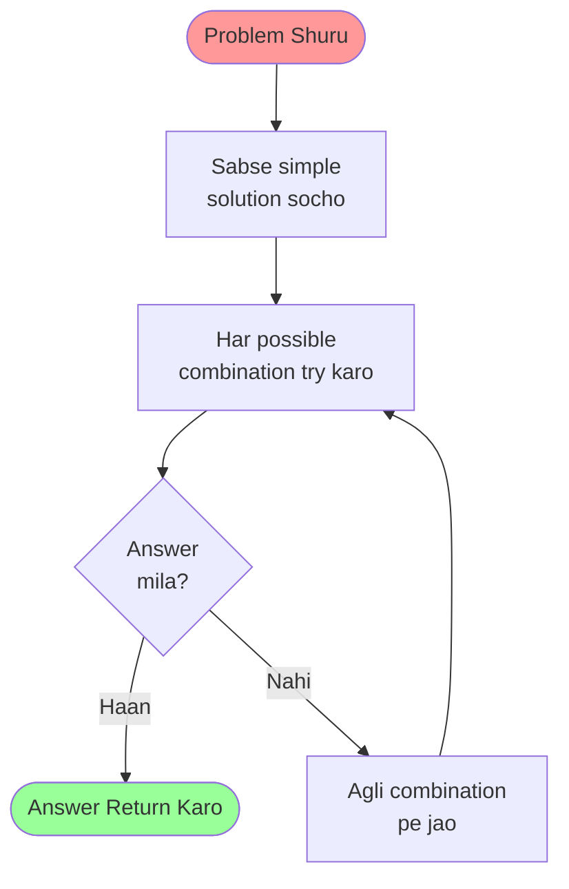
```mermaid
flowchart TD
    A([Problem Shuru]) --> B[Sabse simple\nsolution socho]
    B --> C[Har possible\ncombination try karo]
    C --> D{Answer\nmila?}
    D -->|Haan| E([Answer Return Karo])
    D -->|Nahi| F[Agli combination\npe jao]
    F --> C

    style A fill:#ff9999
    style E fill:#99ff99
```

**Kab use karo:**
- Constraints choti ho → `n ≤ 100`
- Problem nai samajh aai — pehle brute force socho
- Hamesha starting point

**Kab mat use karo:**
- `n ≥ 10,000` — TLE aayega

---

## 2. Two Pointers

> **Iska kaam:** Do ungliyan array ke do siron pe — ek left, ek right. Dono andar aate hain.

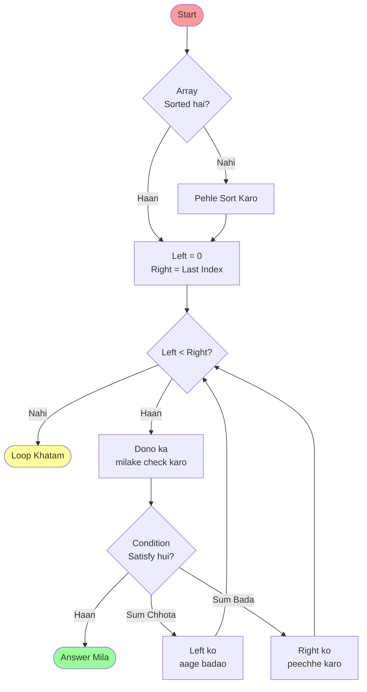
```mermaid
flowchart TD
    A([Start]) --> B{Array\nSorted hai?}
    B -->|Nahi| C[Pehle Sort Karo]
    B -->|Haan| D[Left = 0\nRight = Last Index]
    C --> D

    D --> E{Left < Right?}
    E -->|Nahi| DONE([Loop Khatam])

    E -->|Haan| F[Dono ka\nmilake check karo]
    F --> G{Condition\nSatisfy hui?}

    G -->|Haan| H([Answer Mila])
    G -->|Sum Chhota| I[Left ko\naage badao]
    G -->|Sum Bada| J[Right ko\npeechhe karo]

    I --> E
    J --> E

    style A fill:#ff9999
    style H fill:#99ff99
    style DONE fill:#ffff99
```

**Kab use karo:**
```
✅ Sorted array mein pair dhundna
✅ Remove duplicates
✅ Container with most water
✅ 3Sum, 4Sum
```

**Flow in Mind:**
```
[1, 2, 3, 4, 5]  target=6
 L           R   → 1+5=6 ✅ DONE
```

---

## 3. Sliding Window

> **Iska kaam:** Ek khidki (window) array pe slide karo — pura dobara mat dekho.

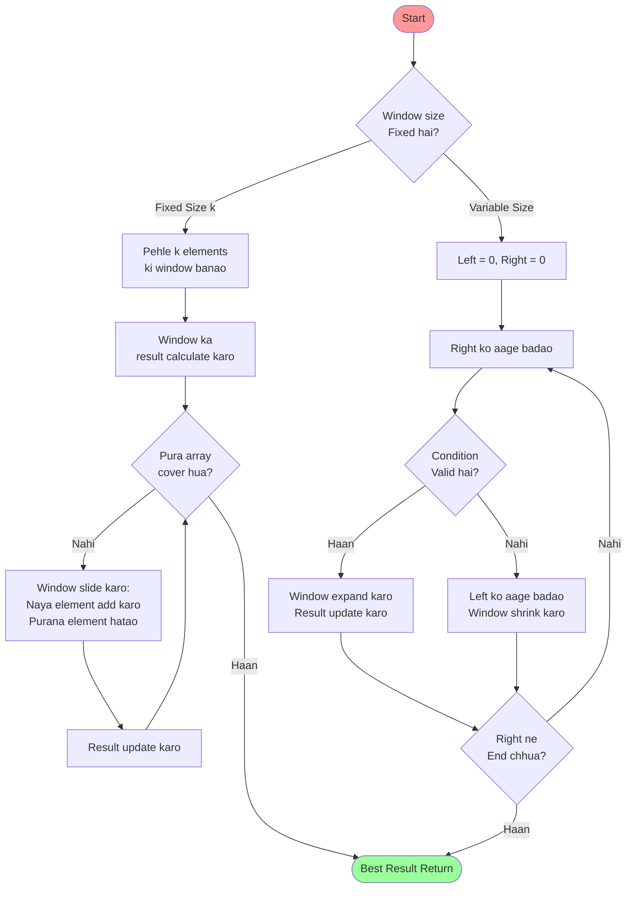
```mermaid
flowchart TD
    A([Start]) --> B{Window size\nFixed hai?}

    B -->|Fixed Size k| C[Pehle k elements\nki window banao]
    C --> D[Window ka\nresult calculate karo]
    D --> E{Pura array\ncover hua?}
    E -->|Nahi| F[Window slide karo:\nNaya element add karo\nPurana element hatao]
    F --> G[Result update karo]
    G --> E
    E -->|Haan| DONE([Best Result Return])

    B -->|Variable Size| H[Left = 0, Right = 0]
    H --> I[Right ko aage badao]
    I --> J{Condition\nValid hai?}
    J -->|Haan| K[Window expand karo\nResult update karo]
    J -->|Nahi| L[Left ko aage badao\nWindow shrink karo]
    K --> M{Right ne\nEnd chhua?}
    L --> M
    M -->|Nahi| I
    M -->|Haan| DONE

    style A fill:#ff9999
    style DONE fill:#99ff99
```

**Kab use karo:**
```
✅ Max sum subarray of size k       → Fixed Window
✅ Longest substring without repeat → Variable Window
✅ Minimum window substring         → Variable Window
✅ Koi bhi "contiguous subarray"    → Sliding Window
```

**Key Insight:**
```
Fixed Window   → Ek element add, ek remove (right - left = k hamesha)
Variable Window → Condition break ho to left badao
```

---

## 4. Binary Search

> **Iska kaam:** Har baar search space ko aadha karo.

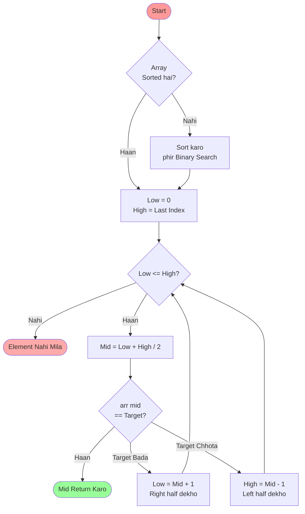
```mermaid
flowchart TD
    A([Start]) --> B{Array\nSorted hai?}
    B -->|Nahi| C[Sort karo\nphir Binary Search]
    B -->|Haan| D[Low = 0\nHigh = Last Index]
    C --> D

    D --> E{Low <= High?}
    E -->|Nahi| NOT_FOUND([Element Nahi Mila])

    E -->|Haan| F[Mid = Low + High / 2]
    F --> G{arr mid\n== Target?}

    G -->|Haan| FOUND([Mid Return Karo])
    G -->|Target Bada| H[Low = Mid + 1\nRight half dekho]
    G -->|Target Chhota| I[High = Mid - 1\nLeft half dekho]

    H --> E
    I --> E

    style A fill:#ff9999
    style FOUND fill:#99ff99
    style NOT_FOUND fill:#ffaaaa
```

**Kab use karo:**
```
✅ Sorted array mein search
✅ First/Last occurrence
✅ Peak element
✅ "Minimum days/speed possible" (answer pe binary search)
✅ Square root find karna
```

**Advanced Pattern — Answer pe Binary Search:**
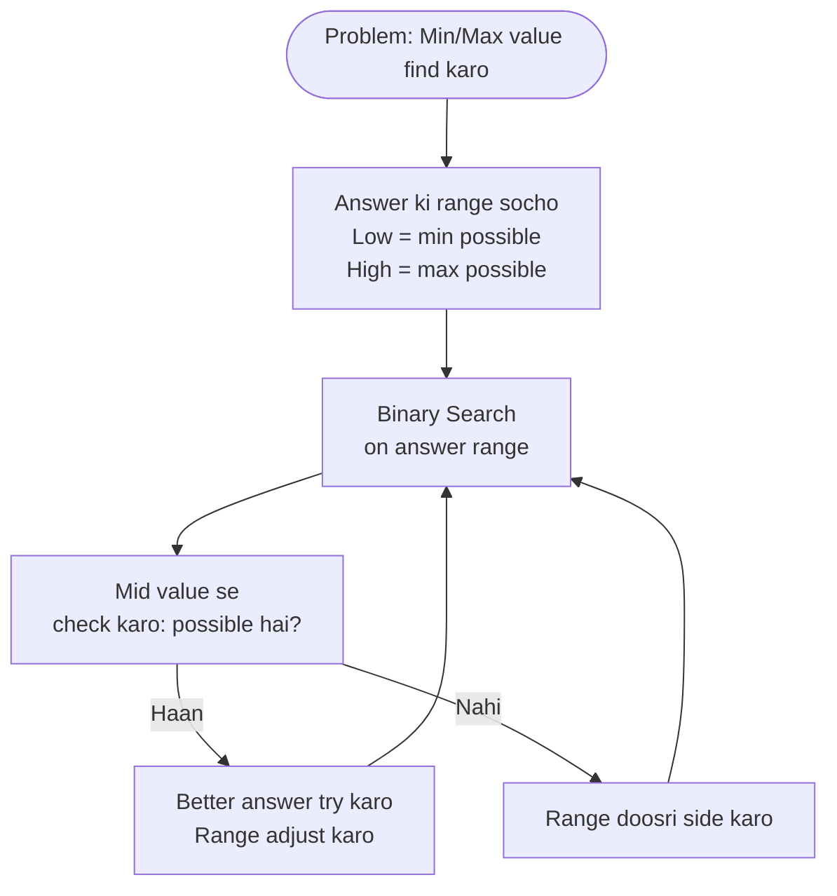
```mermaid
flowchart TD
    A([Problem: Min/Max value find karo]) --> B[Answer ki range socho\nLow = min possible\nHigh = max possible]
    B --> C[Binary Search\non answer range]
    C --> D[Mid value se\ncheck karo: possible hai?]
    D -->|Haan| E[Better answer try karo\nRange adjust karo]
    D -->|Nahi| F[Range doosri side karo]
    E --> C
    F --> C
```

---

## 5. HashMap / HashSet

> **Iska kaam:** O(1) mein store karo, O(1) mein dhundo.

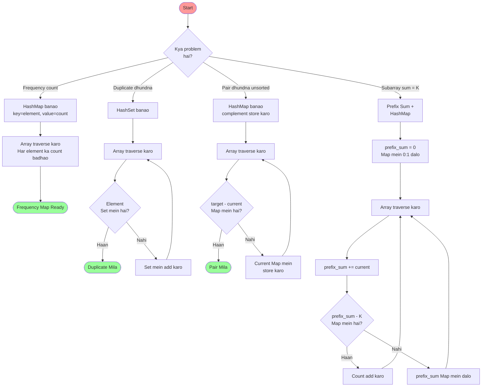
```mermaid
flowchart TD
    A([Start]) --> B{Kya problem\nhai?}

    B -->|Frequency count| C[HashMap banao\nkey=element, value=count]
    B -->|Duplicate dhundna| D[HashSet banao]
    B -->|Pair dhundna unsorted| E[HashMap banao\ncomplement store karo]
    B -->|Subarray sum = K| F[Prefix Sum +\nHashMap]

    C --> C1[Array traverse karo\nHar element ka count badhao]
    C1 --> C2([Frequency Map Ready])

    D --> D1[Array traverse karo]
    D1 --> D2{Element\nSet mein hai?}
    D2 -->|Haan| D3([Duplicate Mila])
    D2 -->|Nahi| D4[Set mein add karo]
    D4 --> D1

    E --> E1[Array traverse karo]
    E1 --> E2{target - current\nMap mein hai?}
    E2 -->|Haan| E3([Pair Mila])
    E2 -->|Nahi| E4[Current Map mein\nstore karo]
    E4 --> E1

    F --> F1[prefix_sum = 0\nMap mein 0:1 dalo]
    F1 --> F2[Array traverse karo]
    F2 --> F3[prefix_sum += current]
    F3 --> F4{prefix_sum - K\nMap mein hai?}
    F4 -->|Haan| F5[Count add karo]
    F4 -->|Nahi| F6[prefix_sum Map mein dalo]
    F5 --> F2
    F6 --> F2

    style A fill:#ff9999
    style C2 fill:#99ff99
    style D3 fill:#99ff99
    style E3 fill:#99ff99
```

---

## 6. Recursion

> **Iska kaam:** Problem ko chhoti problem mein todo. Apne aap ko call karo.

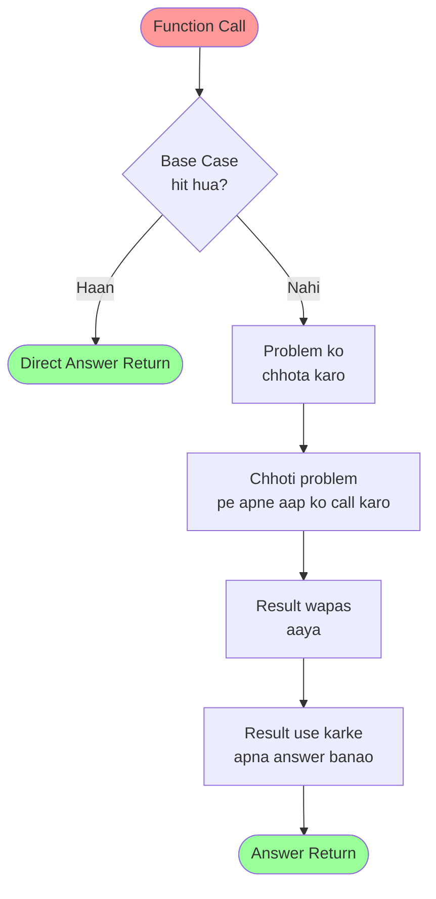
```mermaid
flowchart TD
    A([Function Call]) --> B{Base Case\nhit hua?}
    B -->|Haan| C([Direct Answer Return])
    B -->|Nahi| D[Problem ko\nchhota karo]
    D --> E[Chhoti problem\npe apne aap ko call karo]
    E --> F[Result wapas\naaya]
    F --> G[Result use karke\napna answer banao]
    G --> H([Answer Return])

    style A fill:#ff9999
    style C fill:#99ff99
    style H fill:#99ff99
```

**3 Cheezein Hamesha Socho:**
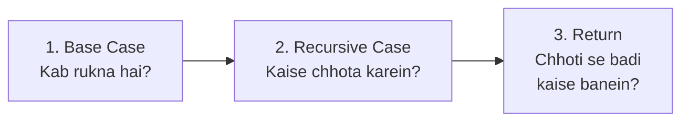
```mermaid
flowchart LR
    A[1. Base Case\nKab rukna hai?] --> B[2. Recursive Case\nKaise chhota karein?]
    B --> C[3. Return\nChhoti se badi\nkaise banein?]
```

**Kab use karo:**
```
✅ Tree problems (DFS)
✅ Factorial, Fibonacci
✅ Divide & Conquer
✅ Backtracking ka base
```

---

## 7. Backtracking

> **Iska kaam:** Ek raasta chuno → aage jao → galat nikla? → Wapas aao → Doosra raasta chuno.

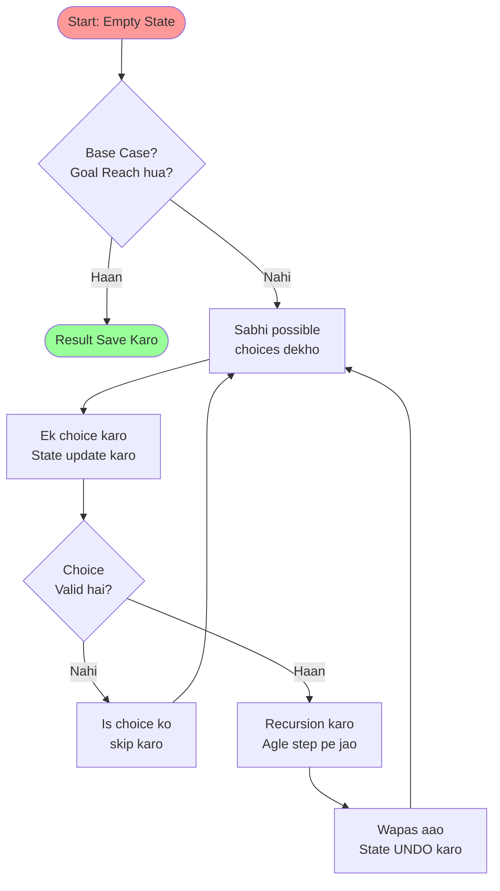
```mermaid
flowchart TD
    A([Start: Empty State]) --> B{Base Case?\nGoal Reach hua?}
    B -->|Haan| C([Result Save Karo])
    B -->|Nahi| D[Sabhi possible\nchoices dekho]
    D --> E[Ek choice karo\nState update karo]
    E --> F{Choice\nValid hai?}
    F -->|Nahi| G[Is choice ko\nskip karo]
    F -->|Haan| H[Recursion karo\nAgle step pe jao]
    H --> I[Wapas aao\nState UNDO karo]
    I --> D
    G --> D

    style A fill:#ff9999
    style C fill:#99ff99
```

**Mental Model — Choose → Explore → Unchoose:**
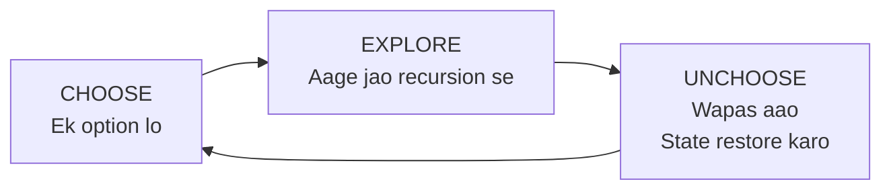
```mermaid
flowchart LR
    A[CHOOSE\nEk option lo] --> B[EXPLORE\nAage jao recursion se]
    B --> C[UNCHOOSE\nWapas aao\nState restore karo]
    C --> A
```

**Kab use karo:**
```
✅ All subsets
✅ All permutations
✅ N-Queens
✅ Sudoku solver
✅ Word search in grid
✅ "Generate all..." type problems
```

**Decision tree example — Subsets of [1,2,3]:**
```
                    []
               /         \
           [1]             []
          /   \           /   \
       [1,2]  [1]      [2]    []
       /  \                  /  \
  [1,2,3][1,2]           [3]   []
```

---

## 8. Dynamic Programming (DP)

> **Iska kaam:** Baar baar repeat hone wale subproblems ka answer store karo — dobara calculate mat karo.

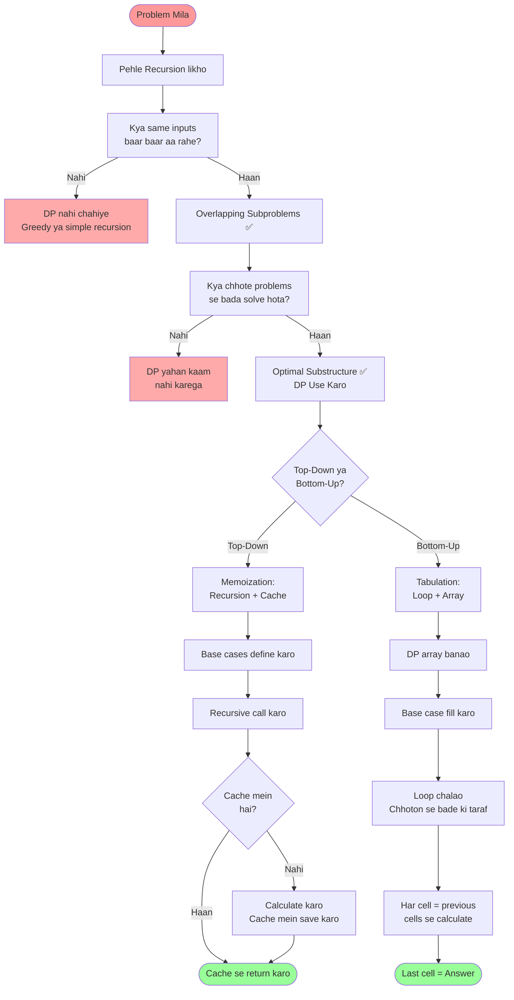
```mermaid
flowchart TD
    A([Problem Mila]) --> B[Pehle Recursion likhо]
    B --> C[Kya same inputs\nbaar baar aa rahe?]
    C -->|Nahi| D[DP nahi chahiye\nGreedy ya simple recursion]
    C -->|Haan| E[Overlapping Subproblems ✅]
    E --> F[Kya chhote problems\nse bada solve hota?]
    F -->|Nahi| G[DP yahan kaam\nnahi karega]
    F -->|Haan| H[Optimal Substructure ✅\nDP Use Karo]

    H --> I{Top-Down ya\nBottom-Up?}

    I -->|Top-Down| J[Memoization:\nRecursion + Cache]
    I -->|Bottom-Up| K[Tabulation:\nLoop + Array]

    J --> J1[Base cases define karo]
    J1 --> J2[Recursive call karo]
    J2 --> J3{Cache mein\nhai?}
    J3 -->|Haan| J4([Cache se return karo])
    J3 -->|Nahi| J5[Calculate karo\nCache mein save karo]
    J5 --> J4

    K --> K1[DP array banao]
    K1 --> K2[Base case fill karo]
    K2 --> K3[Loop chalao\nChhoton se bade ki taraf]
    K3 --> K4[Har cell = previous\ncells se calculate]
    K4 --> K5([Last cell = Answer])

    style A fill:#ff9999
    style J4 fill:#99ff99
    style K5 fill:#99ff99
    style D fill:#ffaaaa
    style G fill:#ffaaaa
```

**DP Identify Karne Ka Trick:**
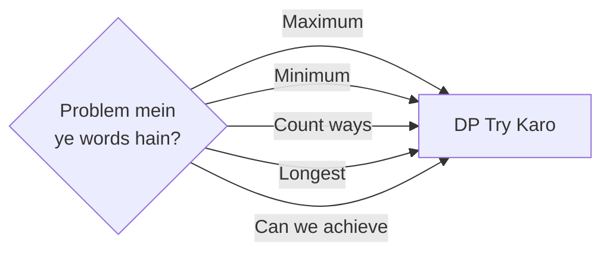
```mermaid
flowchart LR
    A{Problem mein\nye words hain?} -->|Maximum| B[DP Try Karo]
    A -->|Minimum| B
    A -->|Count ways| B
    A -->|Longest| B
    A -->|Can we achieve| B
```

**Kab use karo:**
```
✅ Fibonacci sequence
✅ Coin change (minimum coins)
✅ Longest common subsequence
✅ Knapsack (0/1)
✅ Maximum subarray sum
✅ Edit distance
```

---

## 9. Greedy

> **Iska kaam:** Har step pe sabse accha (locally optimal) choice lo. Trust karo ki global answer bhi sahi hoga.

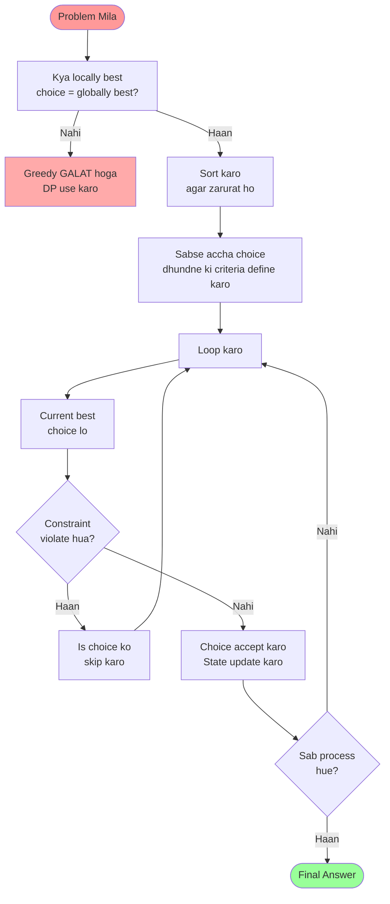
```mermaid
flowchart TD
    A([Problem Mila]) --> B[Kya locally best\nchoice = globally best?]
    B -->|Nahi| C[Greedy GALAT hoga\nDP use karo]
    B -->|Haan| D[Sort karo\nagar zarurat ho]
    D --> E[Sabse accha choice\ndhundne ki criteria define karo]
    E --> F[Loop karo]
    F --> G[Current best\nchoice lo]
    G --> H{Constraint\nviolate hua?}
    H -->|Haan| I[Is choice ko\nskip karo]
    H -->|Nahi| J[Choice accept karo\nState update karo]
    I --> F
    J --> K{Sab process\nhue?}
    K -->|Nahi| F
    K -->|Haan| L([Final Answer])

    style A fill:#ff9999
    style L fill:#99ff99
    style C fill:#ffaaaa
```

**Greedy vs DP — Kab kya:**
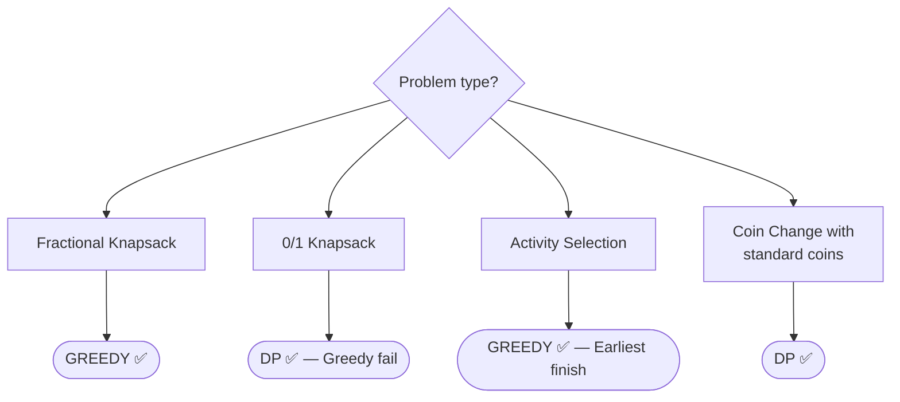
```mermaid
flowchart TD
    A{Problem type?} --> B[Fractional Knapsack]
    A --> C[0/1 Knapsack]
    A --> D[Activity Selection]
    A --> E[Coin Change with\nstandard coins]

    B --> B1([GREEDY ✅])
    C --> C1([DP ✅ — Greedy fail])
    D --> D1([GREEDY ✅ — Earliest finish])
    E --> E1([DP ✅])
```

**Kab use karo:**
```
✅ Activity selection (earliest finish first)
✅ Fractional knapsack
✅ Huffman encoding
✅ Minimum spanning tree (Kruskal, Prim)
✅ Dijkstra shortest path
```

---

## 10. BFS — Breadth First Search

> **Iska kaam:** Level by level chalо. Pehle saare neighbours, phir unke neighbours.

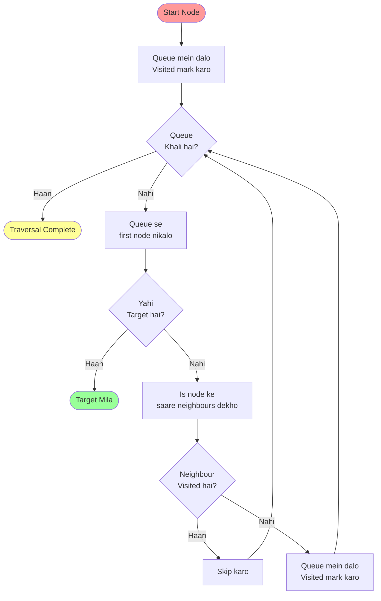
```mermaid
flowchart TD
    A([Start Node]) --> B[Queue mein dalo\nVisited mark karo]
    B --> C{Queue\nKhali hai?}
    C -->|Haan| DONE([Traversal Complete])
    C -->|Nahi| D[Queue se\nfirst node nikalo]
    D --> E{Yahi\nTarget hai?}
    E -->|Haan| FOUND([Target Mila])
    E -->|Nahi| F[Is node ke\nsaare neighbours dekho]
    F --> G{Neighbour\nVisited hai?}
    G -->|Haan| H[Skip karo]
    G -->|Nahi| I[Queue mein dalo\nVisited mark karo]
    H --> C
    I --> C

    style A fill:#ff9999
    style FOUND fill:#99ff99
    style DONE fill:#ffff99
```

**BFS Level Order Visualization:**
```
Level 0:        [1]
Level 1:      [2]  [3]
Level 2:   [4][5]  [6][7]

Queue: 1 → 2,3 → 4,5,6,7
```

**Kab use karo:**
```
✅ Shortest path (unweighted graph)
✅ Level order tree traversal
✅ "Minimum steps to reach target"
✅ Connected components
✅ Rotten oranges, Word ladder
```

---

## 11. DFS — Depth First Search

> **Iska kaam:** Ek raasta pakdo aur end tak jao. Phir wapas aao aur doosra try karo.

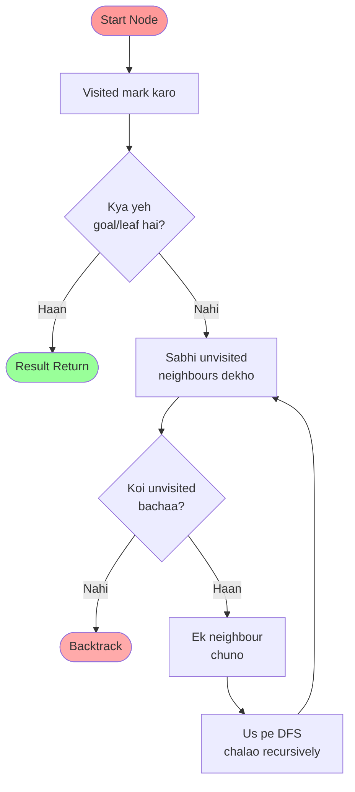
```mermaid
flowchart TD
    A([Start Node]) --> B[Visited mark karo]
    B --> C{Kya yeh\ngoal/leaf hai?}
    C -->|Haan| D([Result Return])
    C -->|Nahi| E[Sabhi unvisited\nneighbours dekho]
    E --> F{Koi unvisited\nbachaa?}
    F -->|Nahi| G([Backtrack])
    F -->|Haan| H[Ek neighbour\nchuno]
    H --> I[Us pe DFS\nchalaо recursively]
    I --> E

    style A fill:#ff9999
    style D fill:#99ff99
    style G fill:#ffaaaa
```

**DFS Stack Visualization:**
```
Graph: 1-2-4
       |
       3-5

DFS order: 1 → 2 → 4 (backtrack) → 3 → 5
Stack: [1] → [1,2] → [1,2,4] → [1,2] → [1] → [1,3] → [1,3,5]
```

**BFS vs DFS — Quick Compare:**

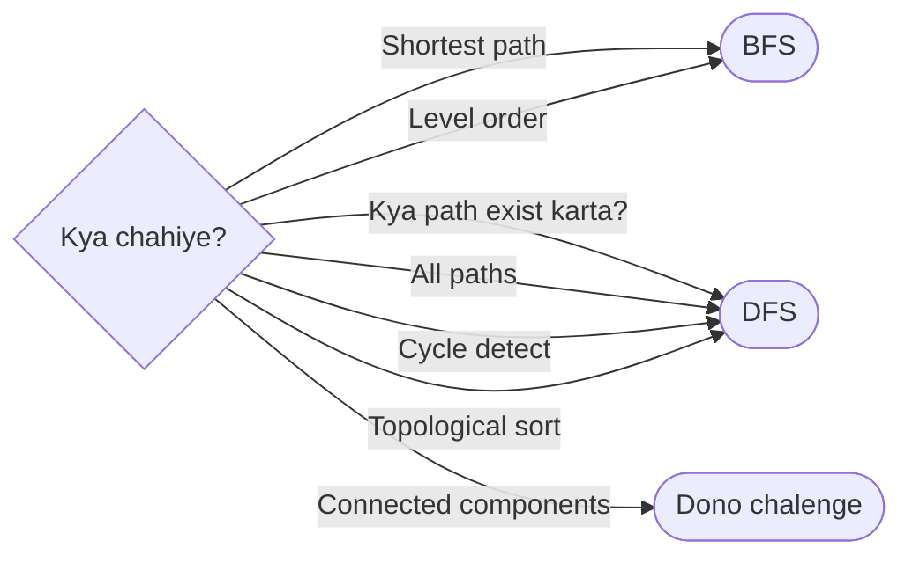
```mermaid
flowchart LR
    A{Kya chahiye?} -->|Shortest path| B([BFS])
    A -->|Kya path exist karta?| C([DFS])
    A -->|All paths| C
    A -->|Level order| B
    A -->|Cycle detect| C
    A -->|Topological sort| C
    A -->|Connected components| D([Dono chalenge])
```

---

## 12. Divide and Conquer

> **Iska kaam:** Problem ko halves mein todo. Har half solve karo. Results combine karo.

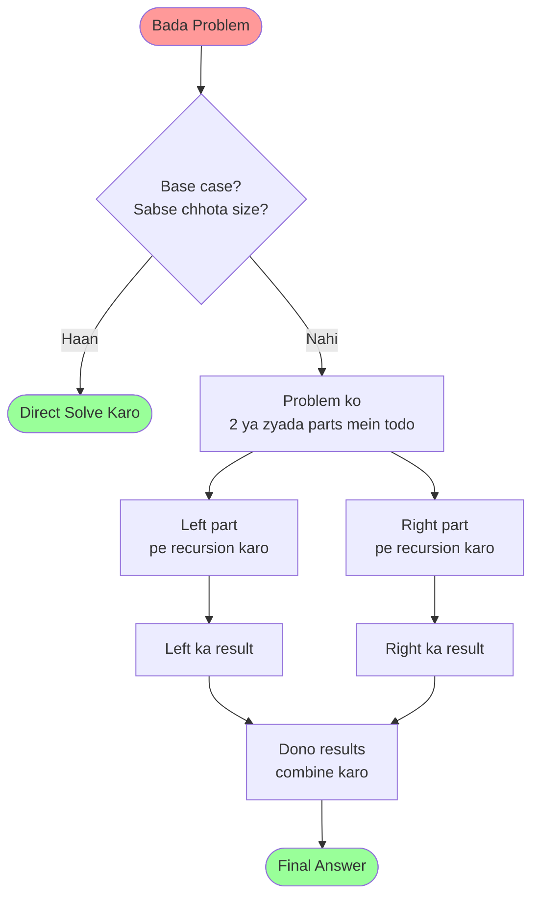
```mermaid
flowchart TD
    A([Bada Problem]) --> B{Base case?\nSabse chhota size?}
    B -->|Haan| C([Direct Solve Karo])
    B -->|Nahi| D[Problem ko\n2 ya zyada parts mein todo]
    D --> E[Left part\npe recursion karo]
    D --> F[Right part\npe recursion karo]
    E --> G[Left ka result]
    F --> H[Right ka result]
    G --> I[Dono results\ncombine karo]
    H --> I
    I --> J([Final Answer])

    style A fill:#ff9999
    style C fill:#99ff99
    style J fill:#99ff99
```

**Kab use karo:**
```
✅ Merge Sort
✅ Quick Sort
✅ Binary Search
✅ Maximum subarray (Kadane's divide version)
✅ Closest pair of points
```

---

## Master Summary — Ek Nazar Mein

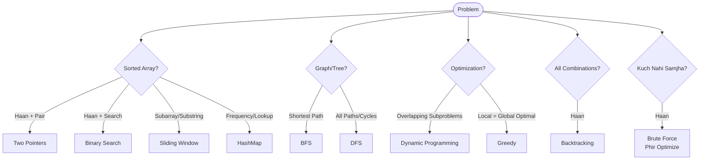
```mermaid
flowchart TD
    P([Problem]) --> S1{Sorted Array?}
    S1 -->|Haan + Pair| TP[Two Pointers]
    S1 -->|Haan + Search| BS[Binary Search]
    S1 -->|Subarray/Substring| SW[Sliding Window]
    S1 -->|Frequency/Lookup| HM[HashMap]

    P --> S2{Graph/Tree?}
    S2 -->|Shortest Path| BFS_N[BFS]
    S2 -->|All Paths/Cycles| DFS_N[DFS]

    P --> S3{Optimization?}
    S3 -->|Overlapping Subproblems| DP_N[Dynamic Programming]
    S3 -->|Local = Global Optimal| GR[Greedy]

    P --> S4{All Combinations?}
    S4 -->|Haan| BT[Backtracking]

    P --> S5{Kuch Nahi Samjha?}
    S5 -->|Haan| BF[Brute Force\nPhir Optimize]
```

---

## Complexity Quick Reference

| Approach | Time | Space |
|---|---|---|
| Brute Force | O(n²) ya bura | O(1) |
| Two Pointers | O(n) | O(1) |
| Sliding Window | O(n) | O(1) |
| Binary Search | O(log n) | O(1) |
| HashMap | O(n) | O(n) |
| Recursion | O(branches^depth) | O(depth) |
| Backtracking | O(n!) worst | O(n) |
| DP | O(n²) typical | O(n) ya O(n²) |
| Greedy | O(n log n) sort | O(1) |
| BFS/DFS | O(V + E) | O(V) |

---

> **Golden Rule:**
> Brute Force → Pattern Identify → Right Approach → Optimize
> Kabhi bhi seedha optimize mat karo.